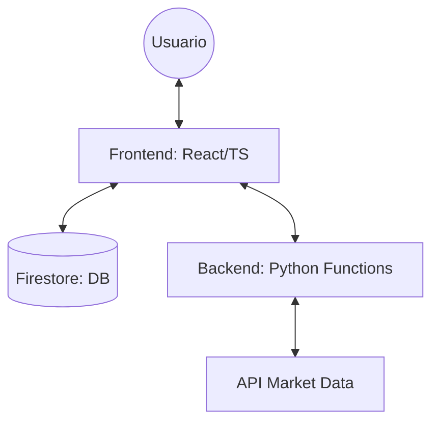

# Informe de Estructura y Funcionamiento del Sistema - BDB-FONDOS

Este documento detalla la arquitectura técnica, la organización de archivos y el flujo de operación del ecosistema **BDB-FONDOS**.

---

## 1. Arquitectura General
El sistema utiliza una arquitectura **Híbrida Cliente-Servidor** basada en la plataforma **Firebase**.

*   **Frontend**: Aplicación Web Single Page (SPA) de alta fidelidad.
*   **Backend**: Funciones serverless (Cloud Functions) que actúan como API de procesamiento.
*   **Base de Datos**: Firestore (NoSQL) para persistencia en tiempo real.
*   **Infraestructura**: Firebase Hosting y Google Cloud.

---

## 2. Estructura del Frontend (`/frontend`)
La interfaz está construida con **React 18** y **TypeScript**, enfocada en la visualización de datos financieros.

### Carpetas Principales
*   `src/pages/`: Vistas principales de la aplicación.
    *   `XRayPage.tsx`: Dashboard de análisis profundo de carteras.
*   `src/components/`: Componentes modulares y reutilizables.
    *   `charts/`: Motores gráficos (Chart.js/Plotly) para historial de fondos, fronteras eficientes y riesgos.
    *   `dashboard/`: Tarjetas de métricas, volatilidad y Sharpe.
    *   `modals/`: Interfaces para comparación de fondos y estructuras de cartera.
*   `src/hooks/`: Lógica de estado extraída.
    *   `useXRayAnalytics.ts`: Orquestador de datos para el análisis X-Ray.
    *   `usePortfolioStats.ts`: Cálculo de pesos y métricas en tiempo real.
*   `src/utils/`: Funciones auxiliares.
    *   `pdfGenerator.ts`: Generación de reportes premium para clientes.
    *   `csvImport.ts`: Procesamiento de carteras externas.

---

## 3. Estructura del Backend (`/functions_python`)
El núcleo analítico está escrito en **Python**, lo que permite utilizar bibliotecas de vanguardia en finanzas cuantitativas.

### Servicios Críticos (`services/`)
*   `optimizer.py`: **El Cerebro.** Implementa Optimización de Media-Varianza y Max-Sharpe.
*   `backtester.py`: Simula el rendimiento histórico de las carteras propuestas vs benchmarks.
*   `market.py`: Gestiona la conexión con proveedores de datos para obtener precios y dividendos.
*   `research.py`: Algoritmos avanzados para la búsqueda de activos correlacionados y estrategias.
*   `pdf_generator.py`: Lógica de backend para la generación de reportes complejos con gráficos pesados.

---

## 4. Funcionamiento y Flujo de Datos

### Paso 1: Ingesta y Selección
El usuario puede importar una cartera vía **CSV** o buscar fondos individuales. El frontend normaliza estos datos mediante `normalizer.ts`.

### Paso 2: Análisis en Tiempo Real (X-Ray)
Al cargar una cartera, el frontend realiza cálculos inmediatos de pesos y exposiciones sectoriales. Si se requiere un análisis histórico profundo, se llama al backend:
1.  Frontend envía ISINs y pesos a la Cloud Function.
2.  Backend descarga datos históricos de mercado.
3.  Backend calcula correlaciones, volatilidad histórica y retornos.
4.  Frontend recibe el JSON y lo renderiza en gráficos dinámicos.

### Paso 3: Optimización
Cuando el usuario solicita "Optimizar":
1.  Se envían las restricciones (volatilidad máxima, pesos mínimos).
2.  Python ejecuta un optimizador cuadrático para encontrar la "Frontera Eficiente".
3.  El sistema sugiere cambios de peso para maximizar el retorno por cada unidad de riesgo.

### Paso 4: Reporte Final
Los datos se consolidan para generar un informe profesional en PDF, listo para el cliente final, integrando gráficos y análisis cualitativo.

---

## 5. Tecnologías Clave

| Capa | Tecnología | Propósito |
| :--- | :--- | :--- |
| **Lenguaje** | TypeScript | Tipado fuerte y seguridad en el cliente. |
| **UI** | React + Tailwind | Interfaz rápida y estética premium. |
| **Cálculo** | Python (Pandas/NumPy) | Procesamiento estadístico masivo. |
| **Finanzas** | PyPortfolioOpt | Optimización matemática de activos. |
| **Gráficos** | Chart.js / Plotly | Visualizaciones interactivas de datos. |
| **DB** | Firebase Firestore | Datos en tiempo real y sincronización. |

---

Este sistema ha sido diseñado para ser **modular**, permitiendo añadir nuevos algoritmos de optimización o nuevos proveedores de datos sin afectar la experiencia de usuario.
