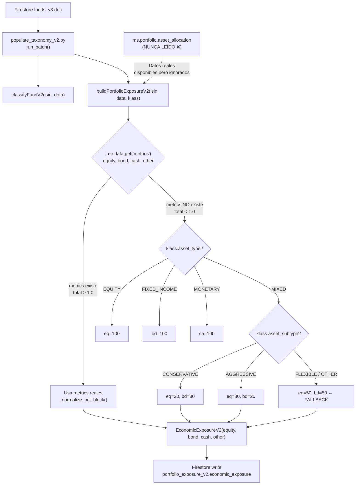

# BDB-MIXED-EXPOSURE-SOURCE-AUDIT-0

**Fecha:** 2026-05-10  
**Estado:** ✅ COMPLETADO — Fix diseñado, pendiente aprobación  
**Commit auditado:** `7529a23` (master)  
**Colección Firestore:** `funds_v3` (producción)

---

## Confirmaciones de Seguridad

- ❌ NO se tocó BDB-FONDOS-CORE
- ❌ NO se escribió en Firestore
- ❌ NO se hizo deploy
- ❌ NO se hizo commit ni push
- ❌ NO se modificó código
- ✅ Solo análisis read-only y documentación

---

## 1. Resumen Ejecutivo

> [!CAUTION]
> **CAUSA RAÍZ IDENTIFICADA:** El fallback 50/50 está **persistido en Firestore** por el script de migración `populate_taxonomy_v2.py`. La función `buildPortfolioExposureV2()` lee `data.get("metrics")` para obtener equity/bond/cash/other, pero los fondos MIXED en producción **no tienen campo `metrics` a nivel raíz**. Al ser `total < 1.0` (es cero), el código entra en el branch de inferencia por clasificación y aplica el fallback 50/50. Los datos reales de Morningstar están en `ms.portfolio.asset_allocation` pero **este campo nunca se lee** en `buildPortfolioExposureV2`.

---

## 2. Respuestas a las Preguntas Clave

### P1: ¿Qué archivo exacto genera el 50/50 persistido en Firestore?

**Archivo:** `scripts/maintenance/populate_taxonomy_v2.py` (y sus copias en `functions_python/scripts/migration/`)

**Función:** `buildPortfolioExposureV2()`, líneas 1595-1753

**Líneas exactas del fallback** (líneas 1613-1627):
```python
if total < 1.0:                              # L1613: metrics está vacío → total=0
    exposure_inferred = True                  # L1614
    ...
    elif klass.asset_type == AssetClassV2.MIXED:  # L1621
        if klass.asset_subtype == AssetSubtypeV2.CONSERVATIVE_ALLOCATION:
            eq, bd = 20.0, 80.0              # L1623
        elif klass.asset_subtype == AssetSubtypeV2.AGGRESSIVE_ALLOCATION:
            eq, bd = 80.0, 20.0              # L1625
        else:
            eq, bd = 50.0, 50.0              # L1627 ← ESTE ES EL 50/50
```

### P2: ¿El 50/50 está persistido o se calcula solo en runtime?

**PERSISTIDO.** El script `run_batch(mode="execute")` (línea 1822-1827) escribe directamente a Firestore:
```python
update_data = {
    "classification_v2": _model_dump(klass),
    "portfolio_exposure_v2": _model_dump(exp),  # ← contiene economic_exposure con 50/50
}
batch_writer.update(doc.reference, update_data)
```

El runtime (`utils.py:get_effective_asset_mix`) tiene su **propio** fallback 50/50 separado (línea 343-350), pero para los 20 fondos MIXED este nunca se activa porque `portfolio_exposure_v2.economic_exposure` ya existe con datos persistidos.

### P3: ¿Hay datos Morningstar suficientes para reemplazarlo?

**SÍ.** Todos los 20 fondos MIXED tienen `ms.portfolio.asset_allocation` con datos reales:

| ISIN | ms.equity | ms.bond | ms.cash | ms.other | econ_exp actual |
|------|----------|---------|---------|----------|-----------------|
| DE0005318406 | 25.15 | 70.49 | 1.37 | 2.98 | eq=20, bd=80 |
| DE000A0X7541 | 63.89 | 19.57 | 15.99 | 0.55 | eq=50, bd=50 ⚠️ |
| DE000DWS17J0 | 68.81 | 18.83 | 3.12 | 9.24 | eq=80, bd=20 |
| ES0110407006 | 87.79 | 4.50 | 0.00 | 7.72 | eq=50, bd=50 ⚠️ |
| ES0114904008 | 85.58 | 0.00 | 10.94 | 3.48 | eq=50, bd=50 ⚠️ |
| ES0116567035 | 24.44 | 80.23 | 0.00 | 0.00 | eq=50, bd=50 ⚠️ |

### P4: ¿Qué campos exactos deben mapearse?

```
ms.portfolio.asset_allocation.equity  → economic_exposure.equity
ms.portfolio.asset_allocation.bond    → economic_exposure.bond
ms.portfolio.asset_allocation.cash    → economic_exposure.cash
ms.portfolio.asset_allocation.other   → economic_exposure.other
```

### P5: ¿Qué escala usan?

**0-100 (porcentajes).** Ejemplo: `equity: 85.58` = 85.58%. La función `_normalize_pct_block` ya maneja esta escala correctamente — normaliza a suma 100 y redondea.

### P6: ¿Cómo evitar doble conteo entre other, alternative y real_asset?

El campo `ms.portfolio.asset_allocation` solo tiene 4 componentes: `equity`, `bond`, `cash`, `other`. El `EconomicExposureV2` model tiene: `equity`, `bond`, `cash`, `other`. No hay `alternative` ni `real_asset` en la fuente Morningstar ni en el model de `populate_taxonomy_v2.py`. El campo `other` de Morningstar se mapea directamente a `other` — no hay riesgo de doble conteo.

> [!NOTE]
> El runtime `get_effective_asset_mix` en `utils.py` sí produce `alternative` y `real_asset`, pero esos campos se extraen de `metrics.alternative` y `metrics.real_asset` que son campos separados. El fix propuesto solo toca la persistencia en `economic_exposure`, no el runtime.

### P7: ¿Qué fondos MIXED quedarían sin exposición real?

**Cero**, si todos los 20 tienen `ms.portfolio.asset_allocation`. Sin embargo, esto debe verificarse con un dry-run antes de cualquier write.

### P8: ¿Qué write gate haría falta?

1. **Pre-condición:** `ms.portfolio.asset_allocation` existe y suma entre 95-105
2. **Pre-condición:** `economic_exposure` actual tiene `exposure_confidence ≤ 0.55` (indicando inferencia)
3. **Guard:** No escribir si `economic_exposure` ya no es 50/50 (ya fue corregido)
4. **Guard:** Generar dry-run artifact con antes/después para revisión humana
5. **Rollback:** Guardar snapshot de `portfolio_exposure_v2` antes del write

### P9: ¿Qué tests deben existir antes de implementar?

Ver §8 abajo.

---

## 3. Pipeline que Alimenta economic_exposure



### Cadena de datos clave

| Paso | Qué ocurre | Dónde |
|------|-----------|-------|
| 1 | Parser Morningstar escribe `ms.portfolio.asset_allocation` | Servicio de parsing (PDF/API) |
| 2 | `fix_service.py` puede escribir `metrics` (legacy) | `services/fix_service.py:198-221` |
| 3 | `populate_taxonomy_v2.py` lee `data.get("metrics")` | Línea 1597 |
| 4 | Si `metrics` está vacío → `total=0 < 1.0` | Línea 1613 |
| 5 | Entra branch de inferencia por clasificación | Líneas 1614-1630 |
| 6 | MIXED + FLEXIBLE → `eq=50, bd=50` | Línea 1627 |
| 7 | `exposure_confidence = 0.55` (inferred) | Línea 1749 |
| 8 | Write batch a Firestore | Líneas 1822-1827 |

---

## 4. ¿Por qué `metrics` está vacío para MIXED?

El campo `metrics` a nivel raíz del documento Firestore es un **campo legacy** escrito por `fix_service.py` (líneas 198-221). Este servicio calcula `metrics` a partir del campo **pre-existente** `metrics` del documento — es decir, solo lo renormaliza, no lo genera de cero.

Para los fondos MIXED, la fuente original de `metrics` nunca fue populada. Los datos de composición de activos llegan exclusivamente vía `ms.portfolio.asset_allocation` del parser de Morningstar. Pero `buildPortfolioExposureV2` **nunca lee** `ms.portfolio`:

```python
# buildPortfolioExposureV2 — Líneas 1596-1608
data = _safe_dict(data)
metrics = _safe_dict(data.get("metrics"))   # ← Lee metrics (vacío para MIXED)
ms = _safe_dict(data.get("ms"))             # ← Lee ms (tiene portfolio.asset_allocation)
# ... pero NUNCA accede a ms.get("portfolio")
```

El script sí usa `ms` para:
- `ms.regions` → `equity_regions` ✅
- `ms.sectors` → `sectors` ✅  
- `ms.equity_style` → `equity_styles` ✅

Pero **omite** `ms.portfolio.asset_allocation` para la composición principal.

---

## 5. Copias del Script de Migración

| Archivo | Tamaño | Línea del fallback | Estado |
|---------|--------|--------------------|--------|
| `scripts/maintenance/populate_taxonomy_v2.py` | 70KB | L1627 | **ACTIVO** |
| `scripts/populate_taxonomy_v2_FINAL.py` | — | L1635→equivalent | Copia histórica |
| `functions_python/scripts/migration/populate_taxonomy_v2.py` | 72KB | L1663 | Copia con más sector subtypes |
| `functions_python/scripts/migration/populate_taxonomy_v2_FINAL_STABLE.py` | 61KB | L1485→equivalent | Copia estable antigua |
| `functions_python/scripts/migration/populate_taxonomy_v2_STABLE_31conflicts.py` | 61KB | Same | Copia con 31 conflictos |
| `functions_python/scripts/migration/populate_taxonomy_v2_STABLE_71conflicts.py` | 61KB | Same | Copia con 71 conflictos |
| `functions_python/scripts/migration/populate_taxonomy_v2_backup.py` | 59KB | L1423→equivalent | Backup antiguo |

> [!WARNING]
> **Todas las copias contienen el mismo bug.** Cualquier fix debe aplicarse al menos a `scripts/maintenance/populate_taxonomy_v2.py` (el activo) y `functions_python/scripts/migration/populate_taxonomy_v2.py` (la copia en functions).

---

## 6. Relación con BDB-SEM-2 (Asset Mix Scale Audit)

El audit BDB-SEM-2 (`bdb_sem_2_asset_mix_fix_plan_dry_run.py`) abordó un problema **diferente pero relacionado**: 450 fondos tenían `portfolio_exposure_v2.asset_mix` en escala 0-1 en lugar de 0-100.

| Aspecto | BDB-SEM-2 | Este Audit |
|---------|-----------|------------|
| Campo afectado | `portfolio_exposure_v2.asset_mix` | `portfolio_exposure_v2.economic_exposure` |
| Problema | Escala 0-1 vs 0-100 | Fallback 50/50 vs datos reales |
| Fondos afectados | ~450 (todos los tipos) | 16 (solo MIXED) |
| Origen | Parser escribía en escala errónea | Migración ignora ms.portfolio |
| Runtime impact | Neutral (optimizer normaliza) | **Alto** (vectores de solver incorrectos) |

---

## 7. Propuesta de Fix (Sin Implementar)

### 7.1 Fix del Script de Migración

**Cambio propuesto** en `buildPortfolioExposureV2()`:

```python
# DESPUÉS de: metrics = _safe_dict(data.get("metrics"))
# AÑADIR lectura de ms.portfolio.asset_allocation como fuente primaria:

ms_portfolio = _safe_dict(ms.get("portfolio"))
ms_alloc = _safe_dict(ms_portfolio.get("asset_allocation"))

# Usar ms_alloc si tiene datos y metrics no los tiene
if ms_alloc and total < 1.0:
    ms_eq = _safe_float(ms_alloc.get("equity", 0.0))
    ms_bd = _safe_float(ms_alloc.get("bond", 0.0))
    ms_ca = _safe_float(ms_alloc.get("cash", 0.0))
    ms_ot = _safe_float(ms_alloc.get("other", 0.0))
    ms_total = ms_eq + ms_bd + ms_ca + ms_ot
    if ms_total >= 10.0:  # Datos Morningstar válidos (escala 0-100)
        eq, bd, ca, oth = ms_eq, ms_bd, ms_ca, ms_ot
        total = ms_total
        exposure_inferred = False  # Ya no es inferido
```

### 7.2 Fix de Datos Existentes (One-Time Patch)

Script dry-run que:
1. Lee todos los fondos con `classification_v2.asset_type == "MIXED"`
2. Para cada uno, compara `economic_exposure` vs `ms.portfolio.asset_allocation`
3. Si `economic_exposure` es exactamente 50/50 Y `ms.portfolio` tiene datos reales:
   - Genera el nuevo `economic_exposure` usando `ms.portfolio.asset_allocation`
   - Actualiza `exposure_confidence` de `0.55` a `0.85`
   - Añade warning `"EXPOSURE_CORRECTED_FROM_MS_PORTFOLIO"`
4. Genera artifact JSON con antes/después para revisión humana
5. Solo aplica writes después de aprobación explícita

### 7.3 Mapping Exacto del Fix

```
FUENTE (Firestore):                        DESTINO (portfolio_exposure_v2):
ms.portfolio.asset_allocation.equity  →    economic_exposure.equity  (escala 0-100)
ms.portfolio.asset_allocation.bond    →    economic_exposure.bond    (escala 0-100)
ms.portfolio.asset_allocation.cash    →    economic_exposure.cash    (escala 0-100)
ms.portfolio.asset_allocation.other   →    economic_exposure.other   (escala 0-100)

exposure_confidence: 0.55 → 0.85 (ya no es inferred)
warnings: añadir "EXPOSURE_SOURCE_MS_PORTFOLIO"
```

---

## 8. Tests Requeridos Antes de Implementar

### 8.1 Tests Unitarios (Nuevos)

```python
# test_mixed_exposure_uses_ms_portfolio.py

def test_mixed_with_ms_portfolio_uses_real_allocation():
    """buildPortfolioExposureV2 should use ms.portfolio.asset_allocation when metrics is empty."""
    data = {
        "name": "Test Mixed Fund",
        "ms": {
            "category_morningstar": "Mixtos Flexibles EUR",
            "portfolio": {"asset_allocation": {"equity": 85, "bond": 5, "cash": 5, "other": 5}},
        }
    }
    klass = classifyFundV2("TEST", data)
    exp = buildPortfolioExposureV2("TEST", data, klass)
    assert exp.economic_exposure.equity == pytest.approx(85, abs=1)
    assert exp.economic_exposure.bond == pytest.approx(5, abs=1)
    assert exp.exposure_confidence >= 0.80

def test_mixed_without_ms_portfolio_falls_back_to_subtype():
    """Without ms.portfolio, should still use subtype-based fallback."""
    data = {"name": "Test Mixed Fund", "ms": {"category_morningstar": "Mixtos Flexibles EUR"}}
    klass = classifyFundV2("TEST", data)
    exp = buildPortfolioExposureV2("TEST", data, klass)
    assert exp.economic_exposure.equity == pytest.approx(50, abs=1)
    assert "EXPOSURE_INFERRED_FROM_CLASSIFICATION" in exp.warnings

def test_metrics_takes_precedence_over_ms_portfolio():
    """If metrics has valid data, it should be used even if ms.portfolio exists."""
    data = {
        "name": "Test Fund",
        "metrics": {"equity": 90, "bond": 5, "cash": 3, "other": 2},
        "ms": {"portfolio": {"asset_allocation": {"equity": 80, "bond": 15, "cash": 3, "other": 2}}},
    }
    klass = classifyFundV2("TEST", data)
    exp = buildPortfolioExposureV2("TEST", data, klass)
    assert exp.economic_exposure.equity == pytest.approx(90, abs=1)
```

### 8.2 Tests de Regresión (Existentes que deben seguir pasando)

```
functions_python/tests/test_mixed_funds_lookthrough_contract.py  (4 tests)
frontend/src/__tests__/mixedFunds.test.ts                        (19 tests)
functions_python/tests/test_suitability_v2.py                     (47 tests)
functions_python/tests/test_optimizer_core.py                     (varies)
```

### 8.3 Test de Dry-Run

Un script que para cada fondo MIXED:
1. Lee doc actual de Firestore
2. Simula `buildPortfolioExposureV2` con y sin fix
3. Compara resultados y genera tabla de diferencias
4. Valida que suma de componentes está entre 95-105

---

## 9. Propuesta de Dry-Run Artifact

Antes de cualquier write a Firestore, generar:

```json
{
  "audit_id": "BDB-MIXED-EXPOSURE-FIX-DRY-RUN",
  "generated_at_utc": "...",
  "mode": "dry-run",
  "write_executed": false,
  "funds_analyzed": 20,
  "funds_to_fix": 16,
  "funds_already_correct": 4,
  "patches": [
    {
      "isin": "ES0114904008",
      "name": "Brightgate Focus A FI",
      "current_economic_exposure": {"equity": 50, "bond": 50, "cash": 0, "other": 0},
      "ms_portfolio_asset_allocation": {"equity": 85.58, "bond": 0, "cash": 10.94, "other": 3.48},
      "proposed_economic_exposure": {"equity": 85.6, "bond": 0.0, "cash": 10.9, "other": 3.5},
      "current_exposure_confidence": 0.55,
      "proposed_exposure_confidence": 0.85,
      "delta_equity": "+35.6",
      "write_guard_passed": true,
      "preconditions": {
        "ms_portfolio_sum_95_105": true,
        "current_is_inferred_fallback": true,
        "not_already_corrected": true
      }
    }
  ]
}
```

---

## 10. Recomendación Final

> [!IMPORTANT]
> **Corregir AMBAS COSAS: datos existentes Y pipeline futuro.**

| Acción | Prioridad | Scope | Riesgo |
|--------|-----------|-------|--------|
| Fix `buildPortfolioExposureV2` para leer `ms.portfolio` | 🔴 Alta | Script de migración | Bajo — solo añade una fuente de datos |
| Patch one-time de 16 fondos MIXED | 🔴 Alta | Firestore funds_v3 | Medio — requiere dry-run + aprobación |
| Añadir tests unitarios | 🟡 Media | Test suite | Ninguno |
| Unificar copias del script | 🟠 Media | Cleanup | Bajo |
| Auditar otros asset_types con metrics vacío | 🟢 Baja | Auditoría ampliada | Ninguno |

### Secuencia Recomendada

1. **Escribir tests** (§8.1) — sin tocar producción
2. **Fix del script** `buildPortfolioExposureV2` — solo en `scripts/maintenance/populate_taxonomy_v2.py`
3. **Dry-run del patch** — generar artifact JSON para revisión
4. **Aprobación humana** del dry-run
5. **Ejecutar patch** con write guards
6. **Validar** que tests existentes siguen pasando
7. **Re-ejecutar** `run_batch(mode="dry-run")` para confirmar que el fix del script produce los mismos resultados que el patch

---

## 11. Archivos Revisados

| Archivo | Líneas Clave | Rol en el Pipeline |
|---------|-------------|-------------------|
| `scripts/maintenance/populate_taxonomy_v2.py` | 1595-1753, 1613-1627 | **ORIGEN del fallback 50/50** |
| `functions_python/scripts/migration/populate_taxonomy_v2.py` | 1631-1789, 1649-1663 | Copia del script con mismo bug |
| `functions_python/services/portfolio/utils.py` | 300-378, 343-350 | Runtime fallback (separado) |
| `functions_python/services/fix_service.py` | 118-221 | Escritor de `metrics` legacy |
| `functions_python/services/portfolio/optimizer_core.py` | 94-121 | Consumer de exposure vectors |
| `functions_python/services/portfolio/suitability_engine.py` | 9-72 | Consumer de exposure para eligibilidad |
| `scripts/maintenance/bdb_sem_2_asset_mix_fix_plan_dry_run.py` | 103-194 | Audit SEM-2 (problema diferente) |
| `scripts/maintenance/bdb_semantic_audit_funds_v3_readonly.py` | 330-460 | Audit de calidad de datos |
| `functions_python/tests/test_mixed_funds_lookthrough_contract.py` | 1-108 | Tests existentes del contract |
| `frontend/src/__tests__/mixedFunds.test.ts` | 1-211 | Tests frontend de MIXED |
