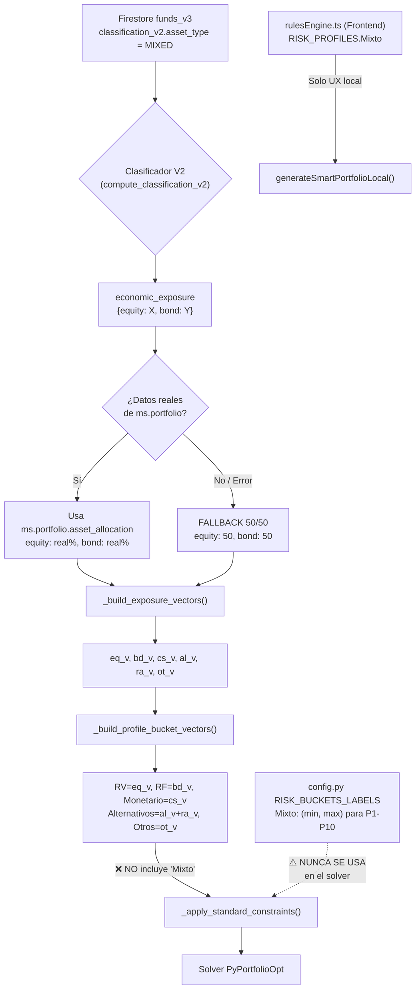

# BDB-OPT-MIXED-FUNDS-SEMANTIC-AUDIT-0

**Fecha:** 2026-05-10  
**Estado:** ✅ COMPLETADO — Pendiente decisión arquitectónica  
**Commit auditado:** `7529a23` (master)  
**Colección Firestore:** `funds_v3` (producción)

---

## 1. Resumen Ejecutivo

> [!CAUTION]
> **HALLAZGO CRÍTICO:** 16 de 20 fondos MIXED en producción tienen `economic_exposure` con valores `equity: 50 / bond: 50` que **NO corresponden** a su composición real reportada por Morningstar. El clasificador V2 está generando un fallback 50/50 masivo en lugar de usar los datos reales de `ms.portfolio.asset_allocation`. Esto afecta directamente la calidad de los vectores de exposición del solver.

### Impacto por Severidad

| Severidad | Hallazgo | Riesgo |
|-----------|----------|--------|
| 🔴 CRÍTICO | 80% de fondos MIXED usan fallback 50/50 en `economic_exposure` | Vectores de solver incorrectos |
| 🔴 CRÍTICO | `_build_profile_bucket_vectors` no produce bucket "Mixto" | Bandas RISK_BUCKETS_LABELS["Mixto"] son código muerto |
| 🟡 ALTO | `exposure_confidence: 0.45` en todos los MIXED | Baja confianza no gatilla ninguna alarma |
| 🟡 ALTO | Frontend y backend divergen en semántica de "Mixto" | UX muestra bucket; solver lo descompone |
| 🟠 MEDIO | Suitability engine no valida incoherencia exposure vs. ms.portfolio | Fondos pueden entrar en perfiles erróneos |

---

## 2. Inventario de Fondos MIXED en Producción

### 2.1 Datos de Firestore `funds_v3` (asset_type = "MIXED")

| ISIN | Nombre | Subtype | ms.equity% | ms.bond% | econ_exp.equity | econ_exp.bond | ¿Fallback? |
|------|--------|---------|-----------|---------|----------------|--------------|------------|
| DE0005318406 | DWS ESG Stiftungsfonds LD | CONSERVATIVE_ALLOCATION | 25.15 | 70.49 | 20 | 80 | ❌ Real |
| DE000A0X7541 | Acatis Value Event Fonds A | FLEXIBLE_ALLOCATION | 63.89 | 19.57 | 50 | 50 | ⚠️ **FALLBACK** |
| DE000DWS17J0 | DWS ESG Dynamic Opportunities LC | AGGRESSIVE_ALLOCATION | 68.81 | 18.83 | 80 | 20 | ❌ Real |
| ES0110407006 | Gestión Boutique VI Argos FI | FLEXIBLE_ALLOCATION | 87.79 | 4.50 | 50 | 50 | ⚠️ **FALLBACK** |
| ES0114904008 | Brightgate Focus A FI | FLEXIBLE_ALLOCATION | 85.58 | 0.00 | 50 | 50 | ⚠️ **FALLBACK** |
| ES0116567035 | Cartesio X FI | CONSERVATIVE_ALLOCATION | 24.44 | 80.23 | 50 | 50 | ⚠️ **FALLBACK** |
| ES0116848005 | — | — | — | — | 80 | 20 | ❌ Real |
| ES0118537002 | — | — | — | — | 50 | 50 | ⚠️ **FALLBACK** |
| ES0128067008 | — | — | — | — | 50 | 50 | ⚠️ **FALLBACK** |
| ES0131462022 | — | — | — | — | 50 | 50 | ⚠️ **FALLBACK** |
| ES0138930005 | — | — | — | — | 50 | 50 | ⚠️ **FALLBACK** |
| ES0142046038 | — | — | — | — | 50 | 50 | ⚠️ **FALLBACK** |
| ES0148181003 | — | — | — | — | 50 | 50 | ⚠️ **FALLBACK** |
| ES0162305033 | — | — | — | — | 50 | 50 | ⚠️ **FALLBACK** |
| ES0162946034 | — | — | — | — | 20 | 80 | ❌ Real |
| ES0162949012 | — | — | — | — | 50 | 50 | ⚠️ **FALLBACK** |
| ES0173323009 | — | — | — | — | 50 | 50 | ⚠️ **FALLBACK** |
| ES0175604034 | — | — | — | — | 50 | 50 | ⚠️ **FALLBACK** |
| FR0010041822 | — | — | — | — | 80 | 20 | ❌ Real |
| FR0010306142 | — | — | — | — | 50 | 50 | ⚠️ **FALLBACK** |

**Resumen:** 4/20 con exposición real (20%), 16/20 con fallback 50/50 (80%)

### 2.2 Ejemplo de Divergencia Extrema

```
Brightgate Focus A FI (ES0114904008)
├─ Morningstar real: equity=85.58%, bond=0%, cash=10.94%
├─ economic_exposure:  equity=50,  bond=50
├─ Solver vector:      eq_v=0.50, bd_v=0.50  ← INCORRECTO
└─ Perfil compatible:  5-10 (correcto por suitability separada)
```

Este fondo con 85.58% de RV real entra al solver como 50% RV / 50% RF, lo cual:
- **Subestima su exposición a renta variable** para perfiles agresivos
- **Sobreestima su RF** para perfiles conservadores
- El solver no puede optimizar correctamente la volatilidad real del portfolio

---

## 3. Flujo de Datos Completo

### 3.1 Diagrama de Flujo



### 3.2 Cadena de Funciones Clave

| Paso | Archivo | Función | ¿Usa "Mixto"? |
|------|---------|---------|--------------|
| 1 | `utils.py:280-358` | `get_effective_asset_mix()` | Sí — genera fallback 50/50 si label="Mixto" |
| 2 | `utils.py:361-378` | `get_profile_bucket_exposure()` | No — mapea a RV, RF, Monetario, Alternativos, Otros |
| 3 | `optimizer_core.py:94-111` | `_build_exposure_vectors()` | No — devuelve eq/bd/cs/al/ra/ot |
| 4 | `optimizer_core.py:114-121` | `_build_profile_bucket_vectors()` | **NO** — solo RV, RF, Monetario, Alternativos, Otros |
| 5 | `optimizer_core.py:689-697` | `_apply_standard_constraints()` | Itera sobre `profile_vectors.items()` que NO incluye Mixto |
| 6 | `config.py:106-187` | `RISK_BUCKETS_LABELS` | Sí — define bandas para Mixto en P1-P10 |
| 7 | `suitability_engine.py:75-111` | `get_economic_bucket()` | Sí — mapea allocation type a buckets económicos |
| 8 | `rulesEngine.ts:300-337` | `getAssetClass()` | Sí — look-through para MIXED/ALLOCATION |
| 9 | `rulesEngine.ts:39-160` | `RISK_PROFILES[].buckets.Mixto` | Sí — solo para generación local UX |

---

## 4. Análisis de Riesgos por Capa

### 4.1 Clasificador V2 → Firestore (Datos)

> [!WARNING]
> **El clasificador V2 que genera `economic_exposure` tiene un fallback indiscriminado.**
> Cuando no puede determinar la composición con alta confianza (todas muestran `exposure_confidence: 0.45`), produce el mismo 50/50 para fondos que van desde 0% equity hasta 88% equity.

**Evidencia:**
- `Brightgate Focus A FI`: ms.equity=85.58% → econ_exp.equity=50 ⚠️
- `Cartesio X FI`: ms.equity=24.44% → econ_exp.equity=50 ⚠️
- `DWS ESG Stiftungsfonds LD`: ms.equity=25.15% → econ_exp.equity=20 ✅

El campo `ms.portfolio.asset_allocation` contiene datos reales de Morningstar que el clasificador **debería estar usando** pero no lo hace en el 80% de los casos.

### 4.2 Backend Solver (optimizer_core.py)

**Hallazgo:** `_build_profile_bucket_vectors` (línea 114-121) mapea:
```python
{
    "RV": eq_v,           # equity vector
    "RF": bd_v,           # bond vector
    "Monetario": cs_v,    # cash vector
    "Alternativos": al_v + ra_v,
    "Otros": ot_v,
}
```

**"Mixto" NO EXISTE como vector de bucket del solver.** Esto significa:
1. Los fondos MIXED se descomponen en sus componentes (equity → RV, bond → RF, etc.)
2. Las bandas `RISK_BUCKETS_LABELS["Mixto"]` definidas en `config.py` **nunca se aplican** como constraint
3. El solver trata un fondo MIXED como si fuera una mezcla explícita de RV/RF/etc.

**Consecuencia:** Un fondo MIXED con exposición 50/50 contribuye 50% al vector RV y 50% al RF. Si el solver pone 20% en ese fondo, aporta 10% RV y 10% RF a las constraints del portfolio.

Esto es **semánticamente correcto** pero **solo si la exposición es real**, no fallback.

### 4.3 Suitability Engine (suitability_engine.py)

La suitability engine usa `extract_v2_identity()` y `get_v2_asset_mix()` para validar elegibilidad:
- Línea 32-33: `real_eq = float(exposure.get("equity", 0.0))` — usa exposure real
- Línea 34-38: Si `has_v2_exposure = False` y perfil ≤ 4 → **rechaza el fondo**
- Línea 48-49: Si `real_eq > 30` y perfil ≤ 2 → **rechaza**

**Riesgo con fallback 50/50:**
- Un fondo MIXED con exposure fallback (equity=50%) será rechazado para perfil 1-2 (>30% gate)
- Pero el mismo fondo podría tener solo 20% equity real → rechazo falso positivo
- Inversamente, un fondo con 85% equity real pero exposure=50% **pasaría** el gate de perfil 3 (>45% limit) cuando no debería

### 4.4 Frontend Rules Engine (rulesEngine.ts)

El frontend **sí implementa look-through** correctamente:
```typescript
// Línea 307-318
if (classV2?.asset_type === 'MIXED' || classV2?.asset_type === 'ALLOCATION') {
    const bucketFromExposure = getAssetClassFromEconomicExposure(expV2);
    if (bucketFromExposure) return bucketFromExposure;
    return 'Mixto'; // fallback
}
```

Pero depende de `economic_exposure` que en el 80% de los casos es 50/50, así que:
- Los fondos con 50eq/50bd caen en threshold `equity >= 25 && bond >= 25` → **siempre se clasifican como "Mixto"**
- Esto es correcto como label comercial pero incorrecto como perfil de riesgo real

**El generador local `generateSmartPortfolioLocal()` usa las bandas de Mixto**, asignando slots y pesos específicos al bucket Mixto.

---

## 5. Divergencia Frontend vs. Backend

| Aspecto | Frontend (rulesEngine.ts) | Backend (optimizer_core.py) |
|---------|--------------------------|----------------------------|
| Bucket "Mixto" | ✅ Existe como AssetClass | ❌ No existe en profile_vectors |
| Bandas min/max | ✅ RISK_PROFILES[n].buckets.Mixto | ⚠️ Definidas en config.py pero nunca usadas |
| Descomposición | Look-through → puede reclasificar | Siempre descompone en eq/bd/cs/al/ra/ot |
| Peso en portfolio | Slot "Mixto" con fondos clasificados Mixto | Contribución proporcional a RV/RF vía vectors |
| Fallback sin datos | Etiqueta "Mixto" | 50% RV + 50% RF en vectores |

> [!IMPORTANT]
> **La divergencia semántica principal:** El frontend asigna un fondo MIXED a un "slot Mixto" y le da peso del bucket Mixto. El backend lo descompone completamente en RV/RF según su exposure. Ambos enfoques son válidos, pero producen portfolios diferentes para el mismo perfil de riesgo.

---

## 6. Bandas Mixto: Código Muerto en el Solver

Las bandas definidas en `config.py` RISK_BUCKETS_LABELS:

| Perfil | Mixto min | Mixto max | ¿Se aplica? |
|--------|-----------|-----------|-------------|
| P1 | 0% | 20% | ❌ Nunca |
| P2 | 0% | 20% | ❌ Nunca |
| P3 | 10% | 30% | ❌ Nunca |
| P4 | 20% | 40% | ❌ Nunca |
| P5 | 20% | 50% | ❌ Nunca |
| P6 | 10% | 40% | ❌ Nunca |
| P7 | 0% | 20% | ❌ Nunca |
| P8 | 0% | 10% | ❌ Nunca |
| P9 | 0% | 5% | ❌ Nunca |
| P10 | 0% | 5% | ❌ Nunca |

Estas bandas son leídas por `_apply_standard_constraints` (línea 689-697), pero como `_build_profile_bucket_vectors` no produce un key "Mixto", la iteración `for bucket_name, vec in profile_vectors.items()` nunca encuentra "Mixto" en `bucket_cfg`, y `_read_bound(bucket_cfg.get("Mixto"))` nunca se ejecuta en contexto de los vectores del solver.

Sin embargo, **sí se usan** si Firestore `system_settings/risk_profiles` contiene las bandas con key "Mixto" y el solver las recibe vía `current_risk_buckets`. Pero dado que `profile_vectors` no tiene "Mixto", no hay vector contra el cual aplicar la constraint.

---

## 7. Tests Existentes

### 7.1 Backend (`test_mixed_funds_lookthrough_contract.py`)

| Test | Resultado | Cobertura |
|------|-----------|-----------|
| `test_mixed_fund_asset_mix_50_50_contributes_to_equity_and_bond` | ✅ PASS | Confirma descomposición 50/50 → RV/RF |
| `test_commercial_classification_does_not_override_solver_exposure` | ✅ PASS | Confirma look-through |
| `test_mixed_fund_does_not_fall_to_otros_when_asset_mix_exists` | ✅ PASS | Previene misclasificación |
| `test_mixed_without_asset_mix_uses_documented_legacy_50_50_fallback_with_warning` | ✅ PASS | Documenta el fallback |

> [!NOTE]
> Los tests **documentan el comportamiento actual** (fallback 50/50) como **intencionado**. No validan si el fallback es correcto vs. datos de Morningstar reales.

### 7.2 Frontend (`mixedFunds.test.ts`)

| Test | Resultado | Cobertura |
|------|-----------|-----------|
| Sidebar MIXED/ALLOCATION filter | ✅ 4/4 | Clasificación UI |
| Autocomplete aggressive gate | ✅ 6/6 | Gating P8-P10 |
| Look-through getAssetClass | ✅ 6/6 | Reclasificación por exposure |
| Taxonomy normalization | ✅ 3/3 | MIXED/ALLOCATION unificación |

### 7.3 Tests Ausentes (Recomendados)

1. **`test_economic_exposure_matches_morningstar_data`** — Validar que `economic_exposure` refleje `ms.portfolio.asset_allocation` cuando existen datos
2. **`test_mixed_fund_suitability_with_real_vs_fallback_exposure`** — Comparar resultados de suitability con exposure real vs. 50/50
3. **`test_solver_constraint_with_mixed_bucket_vector`** — Validar que agregar "Mixto" a `_build_profile_bucket_vectors` no rompe feasibility
4. **`test_portfolio_composition_divergence_frontend_vs_backend`** — Comparar outputs de `generateSmartPortfolioLocal` vs. optimizer real para mismos inputs

---

## 8. Opciones Arquitectónicas

### Opción A: Enforced Mixto como Hard Constraint del Solver

**Cambio:** Agregar `"Mixto"` a `_build_profile_bucket_vectors` con un vector dedicado que identifique fondos clasificados como MIXED.

```python
def _build_profile_bucket_vectors(eq_v, bd_v, cs_v, al_v, ra_v, ot_v, mixed_v):
    return {
        "RV": eq_v,
        "RF": bd_v,
        "Monetario": cs_v,
        "Alternativos": al_v + ra_v,
        "Otros": ot_v,
        "Mixto": mixed_v,  # NEW: vector binario (1.0 si MIXED, 0.0 si no)
    }
```

| ✅ Pros | ❌ Contras |
|---------|-----------|
| Activa las bandas de config.py/Firestore | Doble conteo: fund contribuye a RV Y Mixto |
| Alinea frontend y backend | Puede hacer solver infeasible (constraint conflict) |
| Respeta la tabla original del negocio | Requiere rediseñar vectors (no es aditivo) |

**Veredicto:** ⛔ **No recomendado.** El enfoque de look-through (descomponer en RV/RF) es matemáticamente más preciso. Crear un vector binario de "Mixto" causaría doble conteo con RV/RF.

### Opción B: Strict Look-Through (Estado actual + Fix de datos)

**Cambio:** Corregir el clasificador V2 para que `economic_exposure` use datos reales de Morningstar. Eliminar las bandas "Mixto" de `config.py` como código muerto.

```python
# En el clasificador V2, en lugar de fallback 50/50:
if has_morningstar_allocation:
    economic_exposure = {
        "equity": ms.portfolio.asset_allocation.equity / 100,
        "bond": ms.portfolio.asset_allocation.bond / 100,
        "cash": ms.portfolio.asset_allocation.cash / 100,
        ...
    }
```

| ✅ Pros | ❌ Contras |
|---------|-----------|
| Solver recibe datos reales | Elimina la semántica "Mixto" del negocio |
| No requiere cambios en optimizer_core.py | Puede confundir a usuarios que esperan ver "Mixto" |
| Resuelve el 80% de fallbacks | Necesita parsear ms.portfolio.asset_allocation |

**Veredicto:** ✅ **Recomendado como acción inmediata.** Los datos de Morningstar ya existen en producción. El clasificador V2 debería usarlos.

### Opción C: Hybrid — Look-Through + Review Flag

**Cambio:** Mantener look-through en el solver, pero añadir un campo `requires_manual_exposure_review: true` en la metadata cuando:
1. `classification_v2.asset_type === "MIXED"` AND
2. `economic_exposure` se calculó por fallback (no por datos reales) AND
3. `exposure_confidence < 0.60`

La UI mostraría un badge de advertencia en el admin panel para estos fondos.

| ✅ Pros | ❌ Contras |
|---------|-----------|
| Solver funciona con los mejores datos disponibles | Requiere pipeline de revisión humana |
| Transparencia sobre calidad de datos | No resuelve el problema de forma automática |
| Compatible con Opción B como fix progresivo | Más complejidad operacional |

**Veredicto:** ✅ **Recomendado como complemento.** Implementar junto con Opción B.

---

## 9. Decisión Recomendada

> [!IMPORTANT]
> **RECOMENDACIÓN: Implementar Opción B (Strict Look-Through con datos Morningstar reales) + Opción C (Review Flag para fondos sin datos reales).**

### Plan de Ejecución (Sin tocar solver):

1. **FASE 1 — Fix Clasificador V2** (BDB-FONDOS-CORE)
   - Modificar el pipeline que genera `economic_exposure` para usar `ms.portfolio.asset_allocation` cuando existe
   - Re-ejecutar clasificación para los 20 fondos MIXED
   - Validar que `exposure_confidence` sube de 0.45 a >0.80

2. **FASE 2 — Limpiar Código Muerto** (BDB-FONDOS)
   - Documentar que `RISK_BUCKETS_LABELS["Mixto"]` es solo para seed de presentación (frontend)
   - NO eliminar aún — mantener por backward compatibility con Firestore `system_settings/risk_profiles`

3. **FASE 3 — Review Flag** (BDB-FONDOS)
   - Añadir campo `requires_exposure_review` al output del clasificador
   - Mostrar badge en admin panel para fondos MIXED sin datos reales

4. **FASE 4 — Tests de Regresión**
   - Ejecutar los 4 tests recomendados en §7.3
   - Validar que portfolios generados para P1-P10 cambian de forma esperada con datos reales

### Bandas Mixto: Decisión de Retención

Las bandas `RISK_BUCKETS_LABELS["Mixto"]` en `config.py` y `RISK_PROFILES[].buckets.Mixto` en `rulesEngine.ts`:
- **RETENER** para el generador local de frontend (`generateSmartPortfolioLocal`)
- **DOCUMENTAR** como "presentation seed only" — no influyen en el solver backend
- **NO AGREGAR** al solver como constraint (evitar doble conteo)

---

## 10. Checklist de Validación Post-Fix

```markdown
- [ ] Reclasificar 20 fondos MIXED con datos Morningstar reales
- [ ] Validar que ≥16 fondos cambian de 50/50 a su composición real
- [ ] Ejecutar test_mixed_funds_lookthrough_contract.py (debe seguir pasando)
- [ ] Ejecutar mixedFunds.test.ts (debe seguir pasando)
- [ ] Comparar portfolios P1-P10 antes vs. después del fix
- [ ] Verificar que suitability gates cambian correctamente para perfiles conservadores
- [ ] Documentar fondos que aún no tienen datos Morningstar (si existen)
- [ ] Añadir test de regresión: economic_exposure != {50,50} cuando ms.portfolio existe
```

---

## Archivos Auditados

| Archivo | Líneas Clave | Rol |
|---------|-------------|-----|
| `functions_python/services/config.py` | 106-187 | RISK_BUCKETS_LABELS con Mixto |
| `functions_python/services/portfolio/optimizer_core.py` | 94-121, 588-697 | Exposure vectors + constraints |
| `functions_python/services/portfolio/utils.py` | 300-378 | get_effective_asset_mix fallback |
| `functions_python/services/portfolio/suitability_engine.py` | 9-72, 75-111 | Suitability + economic bucket |
| `frontend/src/utils/rulesEngine.ts` | 39-160, 272-337, 465-648 | RISK_PROFILES + getAssetClass |
| `frontend/src/__tests__/mixedFunds.test.ts` | 1-211 | Frontend tests |
| `functions_python/tests/test_mixed_funds_lookthrough_contract.py` | 1-108 | Backend tests |
