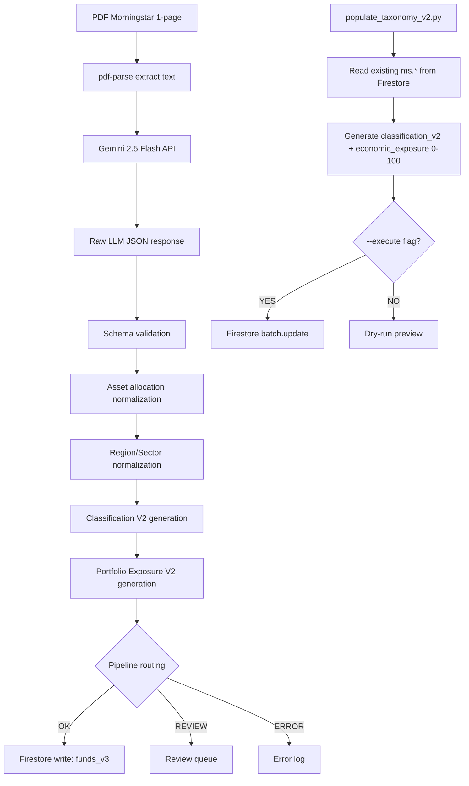

# BDB-PARSER-AUDIT-0 — Auditoría Read-Only del Parser Morningstar

**Fecha**: 2026-05-07  
**Proyecto**: `C:\Users\oanti\Documents\BDB-FONDOS` (legacy)  
**Modo**: READ-ONLY — 0 writes, 0 deploy, 0 push, 0 Gemini calls  
**BDB-FONDOS-CORE**: NO tocado  

---

## Resumen Ejecutivo

Se auditó el pipeline completo **PDF Morningstar → Gemini → JSON → Firestore `funds_v3`** identificando **7 scripts**, **5 writers Firestore**, y **7 riesgos** clasificados por severidad.

| Métrica | Valor |
|---------|-------|
| Scripts encontrados | 7 |
| Writers Firestore activos | 5 |
| Scripts con `--dry-run` | 3 de 5 |
| Scripts que requieren `serviceAccountKey.json` | 2 |
| Scripts que soportan ADC | 3 |
| Riesgo de overwrite de `manual.costs.retrocession` | **NINGUNO** |
| Riesgo de escala | **MEDIO** (dual scale by design) |
| Riesgo semántico oro/minería | **ALTO** (16 fondos) |

### Veredicto: **`PARSER_OK_WITH_WARNINGS`**

> [!NOTE]
> Actualizacion BDB-PARSER-ORG-1: el parser principal fue reubicado a `scripts/MORNINGSTAR_PDF_PARSER/cargador_lotes_v_2.js`. La ruta antigua `scripts/maintenance/cargador_lotes_v_2.js` queda como wrapper compatible. BDB-PARSER-HARDENING-0 ya incorporo dry-run default, gates `--write --confirm-write`, ADC/GOOGLE_APPLICATION_CREDENTIALS y resolucion robusta de CSV/config.

---

## 1. Arquitectura del Parser



### Scripts Principales

| # | Script | Líneas | Rol | Escribe? | Dry-run? |
|---|--------|--------|-----|----------|----------|
| S1 | `scripts/MORNINGSTAR_PDF_PARSER/cargador_lotes_v_2.js` | 3151+ | Parser principal PDF→Gemini→Firestore | ✅ futuro solo con `--write --confirm-write` y `merge:true` | ✅ Default |
| S2 | `cargador_lotes.js` | 1387 | Parser legacy V1 (superseded) | ✅ | ❌ |
| S3 | `populate_taxonomy_v2.py` | 2071 | Clasificador V2 (sin Gemini, sin PDFs) | ✅ `batch.update()` | ✅ Default |
| S4 | `recalculate_derived_fields.js` | 1003 | Recalcula solo `derived.*` | ✅ `bulkWriter.update()` | ✅ `--dry-run` |
| S5 | `update_ms_stars_funds_v3.js` | 243 | Actualiza solo `ms.rating_stars` desde CSV | ✅ `bulkWriter.update()` | ✅ Default |
| S6 | `backfill_asset_class_fill_only_v1.js` | — | Legacy backfill (superseded) | ✅ | ❌ |
| S7 | `backfill_asset_class_aggressive_v1.js` | — | Legacy backfill agresivo (superseded) | ✅ | ❌ |

---

## 2. Seguridad de Writes

### 2.1 Política de Overwrite por Writer

| Writer | Colección | Método | Merge? | Preserva `manual`? | Snapshot? | Rollback? |
|--------|-----------|--------|--------|---------------------|-----------|-----------|
| S1 `scripts/MORNINGSTAR_PDF_PARSER/cargador_lotes_v_2.js` | `funds_v3` | `set(ref, doc, {merge: true})` solo tras `--write --confirm-write` | ✅ | ✅ No incluye `manual.*` en payload | ✅ Lee doc antes | ❌ |
| S3 `populate_taxonomy_v2.py` | `funds_v3` | `batch.update()` | N/A (update) | ✅ Solo toca cv2 + pev2 | ❌ | ❌ |
| S4 `recalculate_derived_fields.js` | `funds_v3` | `bulkWriter.update()` | N/A (update) | ✅ Solo toca `derived.*` | ❌ | ❌ |
| S5 `update_ms_stars_funds_v3.js` | `funds_v3` | `bulkWriter.update()` | N/A (update) | ✅ Solo toca `ms.rating_*` | ❌ | ❌ |

> [!IMPORTANT]
> **Ningún writer toca `manual.costs.retrocession`** excepto para inicializarla a 0 en documentos nuevos (S1). El prompt de Gemini explícitamente excluye retrocesiones: `"NO extraigas: TER, retrocesiones, comisión de entrada o salida."`

### 2.2 Credenciales

| Script | Tipo | ADC? | serviceAccountKey? |
|--------|------|------|--------------------|
| S1 `scripts/MORNINGSTAR_PDF_PARSER/cargador_lotes_v_2.js` | ADC / application default | ✅ | ❌ NO requerido |
| S2 `cargador_lotes.js` | `admin.credential.cert()` | ❌ | ✅ REQUERIDO |
| S3 `populate_taxonomy_v2.py` | Auto-detect | ✅ | ✅ Fallback |
| S4 `recalculate_derived_fields.js` | Auto-detect | ✅ | ✅ Fallback |
| S5 `update_ms_stars_funds_v3.js` | `applicationDefault()` | ✅ | ❌ |

> [!WARNING]
> S1 y S2 **requieren** `serviceAccountKey.json` que fue eliminado en OPT-7. Estos scripts **no pueden ejecutarse** actualmente sin restaurar la clave. Esto es un bloqueo funcional, no un bug.

---

## 3. Análisis de Escalas

### 3.1 Origen de las Dos Escalas

| Campo | Escala | Generado por | Normalización |
|-------|--------|--------------|---------------|
| `pev2.asset_mix` | **0-1** | `cargador_lotes_v_2.js` → `sanitizeAssetMixForExposureBuilder()` | Detecta si max > 1.0 → divide /100, luego rebasa a sum=1.0 |
| `pev2.economic_exposure` | **0-100** | `populate_taxonomy_v2.py` → `_normalize_pct_block()` | Detecta si total ≤ 1.05 → multiplica ×100, luego rebasa a sum=100 |

### 3.2 Explicación de los 220 Fondos sin `asset_mix`

Estos 220 fondos fueron procesados **solo** por `populate_taxonomy_v2.py` (que genera `economic_exposure` a escala 0-100) y **nunca** pasaron por `cargador_lotes_v_2.js` (que genera `asset_mix` a escala 0-1). Esto ocurre cuando no hay PDF disponible para un fondo — la taxonomía se genera a partir de datos existentes en `ms.*`.

### 3.3 Riesgo de Doble Conversión

**BAJO**. Cada script detecta la escala de forma independiente antes de normalizar:
- `sanitizeAssetMixForExposureBuilder()` detecta `max > 1.0` para decidir si dividir
- `_normalize_pct_block()` detecta `total ≤ 1.05` para decidir si multiplicar
- `_as_fraction()` (runtime) detecta `abs(val) > 1.5` para decidir si dividir

### 3.4 Zona Ambigua

> [!WARNING]
> Valores entre **1.0 y 1.5** caen en zona ambigua: `_as_fraction()` no los divide por 100. En los datos actuales no existen valores en ese rango, pero futuras ingestas deben controlar este borde.

---

## 4. Mapping Semántico

### 4.1 Clasificación por Tipo de Activo

| Tipo Morningstar / Derivado | `classification_v2.asset_type` | Correcto? |
|-----------------------------|--------------------------------|-----------|
| RV / Equity | `equity` | ✅ |
| RF / Bond / Credit | `fixed_income` | ✅ |
| Mixto / Allocation / Balanced | `allocation` | ✅ |
| Monetario / Money Market | `money_market` | ✅ |
| Alternativos / Long-Short | `alternative` | ✅ |
| Inmobiliario / Real Estate | `real_asset` | ✅ |
| **Commodities / Gold / Mining** | **`alternative`** | ⚠️ |
| Otros | `other` | ✅ |

### 4.2 Fondos Oro/Minería/Recursos Naturales — Root Cause

El parser identifica correctamente estos fondos como **Commodities** mediante la lista `hardCommodities`:
```javascript
const hardCommodities = [
  "COMMODIT", "MATERIAS PRIMAS", "PRECIOUS METALS",
  "WORLD GOLD", "GLOBAL GOLD", "GOLD FUND",
  "GOLD & SILVER", "GOLD AND PRECIOUS METALS",
  "METALS & MINING", "METALS AND MINING",
  "WORLD MINING", "MINING FUND", "PRECIOUS METALS FUND"
];
```

Luego mapea Commodities → `classification_v2.asset_type = "alternative"`.

El problema es que **Morningstar PDF** reporta `asset_allocation.equity = 0, other = 100` para estos fondos (porque el subyacente es commodity/oro, no acciones directas). El parser reproduce fielmente este dato. El resultado:

- `portfolio_exposure_v2.asset_mix.equity = 0`
- `portfolio_exposure_v2.economic_exposure.equity = 0`

Esto es **correcto según Morningstar** pero **incorrecto para el optimizador** que necesita saber si el fondo invierte en acciones de compañías mineras (que sí son equity).

### 4.3 Fondos Mixtos

El parser maneja correctamente fondos mixtos:
- Clasificación por texto: `ALLOCATION`, `MIXTO`, `BALANCED`, `MULTI ASSET`
- Fallback por métricas: `equity >= 20 && bond >= 20` → MIXED
- Subtipo por texto: `CONSERVATIVE_ALLOCATION`, `AGGRESSIVE_ALLOCATION`, `FLEXIBLE_ALLOCATION`

### 4.4 Fondos Monetarios

Correctamente identificados por múltiples tokens: `MONETARIO`, `MONEY MARKET`, `LIQUIDEZ`, `LIQUIDITY`, `TREASURY`, `VNAV`, `LVNAV`.

---

## 5. Campos Firestore por Writer

### S1: `cargador_lotes_v_2.js`

| Campo | Acción | Fuente |
|-------|--------|--------|
| `root.isin` | SET | PDF/Gemini extracción |
| `root.name` | SET | Gemini extracción |
| `root.currency` | SET | Gemini extracción |
| `ms.*` | SET (merge) | Gemini → normalización completa |
| `derived.*` | SET (merge) | Computado de ms.* |
| `classification_v2.*` | SET (merge) | Computado de ms.* + derived |
| `portfolio_exposure_v2.asset_mix` | SET (merge) | 0-1 scale, computado |
| `quality.*` | SET (merge) | Pipeline metadata |
| `manual.costs.retrocession` | **SOLO SI FALTA** (init 0) | Preservado si existe |
| `asset_class` (legacy) | **DELETE** | Limpieza de campos legacy |
| `std_type` (legacy) | **DELETE** | Limpieza |

### S3: `populate_taxonomy_v2.py`

| Campo | Acción | Fuente |
|-------|--------|--------|
| `classification_v2.*` | UPDATE | Computado de ms.* + texto |
| `portfolio_exposure_v2.economic_exposure` | UPDATE | 0-100 scale, computado |
| `portfolio_exposure_v2.equity_regions` | UPDATE | De ms.regions |
| `portfolio_exposure_v2.sectors` | UPDATE | De ms.sectors |

---

## 6. Trazabilidad

| Aspecto | Presente? | Ubicación |
|---------|-----------|-----------|
| `parser_version` | ✅ | `quality.parser_version`, manifest |
| `source_pdf_hash` | ✅ | `quality.source_pdf_hash` (MD5 + SHA1) |
| `pdf_filename` | ✅ | manifest, canonical JSON |
| `extraction_timestamp` | ✅ | `quality.parsed_at`, `generated_at` |
| `gemini_model` | ✅ | En parser_version string |
| `confidence` | ✅ | `classification_v2.classification_confidence` |
| `warnings` | ✅ | `quality.warnings`, `cv2.warnings`, `pev2.warnings` |
| `raw_evidence` | ✅ | `raw_text/`, `raw_llm/`, `parsed_ms/` |
| `batch_manifest` | ✅ | `batch_manifest.json` |
| `operator/user` | ❌ | No se registra quién ejecutó |
| `dry_run manifest` | ✅ | `artifacts/bdb_parser_audit/parser_dry_run_latest.json` |

---

## 7. Coste y Eficiencia

| Aspecto | Estado |
|---------|--------|
| Modelo Gemini | `gemini-2.5-flash` (default, configurable via `--model`) |
| Parsea PDF completo? | Sí — hasta 240,000 chars |
| Parseo parcial por campos? | No — siempre extrae todo |
| Batch support? | Sí — `p-limit` con concurrency configurable (default 10) |
| Retry support? | Sí — hasta 6 reintentos con backoff exponencial |
| Evita reparsear? | Parcial — mueve PDFs a ok/review/error, pero no chequea ISIN-level |
| CSV para reducir coste? | Solo para subcategory mapping, no para reducir llamadas Gemini |
| Temperatura | 0 (deterministic) |
| Response format | `application/json` (structured output) |

---

## 8. Relación con Retrocesiones

> [!NOTE]
> **Confirmación absoluta**: El parser **NO toca** `manual.costs.retrocession` excepto para inicializar a 0 en documentos nuevos.

- El prompt de Gemini excluye explícitamente TER y retrocesiones.
- `populate_taxonomy_v2.py` no toca `manual.*` (usa `batch.update` solo sobre `cv2` y `pev2`).
- `recalculate_derived_fields.js` no toca `manual.*`.
- `update_ms_stars_funds_v3.js` solo toca `ms.rating_*`.
- Los valores de retrocesión > 1.0 detectados en DATA-AUDIT-0 provienen de importaciones manuales separadas.
- Canon actual: `manual.costs.retrocession` = porcentaje directo (1.41 = 1,41%).

---

## 9. Clasificación de Riesgos

### BLOCKER — Ninguno

El parser no puede sobrescribir datos buenos de forma silenciosa gracias a `merge: true` y la preservación de `manual.*`.

### HIGH

| ID | Riesgo | Detalle |
|----|--------|---------|
| R1 | **Credenciales obsoletas** | Cerrado para S1 en BDB-PARSER-HARDENING-0: usa ADC / `GOOGLE_APPLICATION_CREDENTIALS`. Sigue pendiente revisar S2 legacy. |
| R2 | **Sin dry-run en S1** | Cerrado para S1 en BDB-PARSER-HARDENING-0: dry-run es default y write requiere `--write --confirm-write`. |
| R3 | **Gap semántico oro/minería** | 16 fondos clasificados como equity pero con equity=0% distorsionan bucket bounds del optimizador. |

### MEDIUM

| ID | Riesgo | Detalle |
|----|--------|---------|
| R4 | Dual scale design | `asset_mix` (0-1) vs `economic_exposure` (0-100) causa confusión en auditorías. |
| R5 | Legacy scripts presentes | S2, S6, S7 superseded pero accesibles. Ejecución accidental causaría regresión. |
| R6 | Sin identidad de operador | No se registra quién ejecutó el parser. |

### LOW

| ID | Riesgo | Detalle |
|----|--------|---------|
| R7 | Derived stale risk | S4 puede sobrescribir `derived.*` con lógica ligeramente diferente a S1. |

---

## 10. Relación con BDB-DATA-AUDIT-0

| Hallazgo DATA-AUDIT-0 | Causa según Parser Audit | Severidad |
|------------------------|--------------------------|-----------|
| 220 fondos sin `asset_mix` | Procesados solo por `populate_taxonomy_v2.py` (genera `economic_exposure` 0-100). Nunca pasaron por S1 (genera `asset_mix` 0-1). No hubo PDF disponible. | MEDIUM |
| 16 EQUITY con equity=0% | Morningstar PDF reporta `equity=0, other=100` para fondos de oro/minería. Parser reproduce fielmente. | HIGH |
| 11 derived stale | `derived.asset_class` usa labels legacy (Inmobiliario) vs `cv2.asset_type` usa enum V2 (REAL_ESTATE). Diferentes sistemas. | LOW |
| Escalas mixtas | Diseño intencional: S1 genera 0-1, S3 genera 0-100. Runtime normaliza con `_as_fraction()`. | MEDIUM |
| Retrocesiones > 1.0 | NO causadas por parser. Provienen de importaciones manuales separadas. | MEDIUM |

---

## 11. Recomendaciones

1. **R1-HIGH**: Cerrado para S1 en BDB-PARSER-HARDENING-0: ADC / `GOOGLE_APPLICATION_CREDENTIALS` soportado y `serviceAccountKey.json` no requerido.
2. **R2-HIGH**: Cerrado para S1 en BDB-PARSER-HARDENING-0: dry-run default y write bloqueado sin `--write --confirm-write`.
3. **R3-HIGH**: Crear un mecanismo de override manual para los 16 fondos oro/minería que permita fijar `economic_exposure.equity` según la exposición real a acciones.
4. **R5-MEDIUM**: Archivar o deprecar scripts legacy (S2, S6, S7) con guards que impidan ejecución accidental.
5. **R6-MEDIUM**: Añadir `--operator` flag para registrar identidad del operador en manifests.

---

## 12. Decisión Final

### **PARSER_OK_WITH_WARNINGS**

El parser Morningstar es funcional, produce datos consistentes y protege campos manuales correctamente. Las escalas duales son por diseño y están manejadas por el runtime. Los 3 riesgos HIGH son de configuración/credenciales (R1), usabilidad (R2) y semántica de datos (R3) — ninguno es un bug de código que corrompa datos activamente.

---

## 13. Parser Organization and Proposed Relocation

> [!NOTE]
> **Status actualizado**: BDB-PARSER-ORG-1 reubico el parser real a `scripts/MORNINGSTAR_PDF_PARSER/`. La ruta antigua en `scripts/maintenance/cargador_lotes_v_2.js` es wrapper compatible.

### 13.1 Ubicación Actual

```
scripts/
├── MORNINGSTAR_PDF_PARSER/              ← carpeta dedicada al parser critico
│   ├── cargador_lotes_v_2.js            ← ★ PARSER PRINCIPAL reubicado
│   └── README.md
├── maintenance/                         ← scripts de mantenimiento general
│   ├── cargador_lotes_v_2.js            ← wrapper compatible hacia MORNINGSTAR_PDF_PARSER
│   ├── cargador_lotes.js                ← Parser legacy V1 (43 KB, 1387 líneas)
│   ├── populate_taxonomy_v2.py          ← Clasificador V2 (70 KB, 2071 líneas)
│   ├── recalculate_derived_fields.js    ← Recalculador derived (29 KB, 1003 líneas)
│   ├── update_ms_stars_funds_v3.js      ← Updater estrellas (5 KB, 243 líneas)
│   ├── audit_funds_v3.js                ← Script de auditoría
│   ├── import_retrocesiones.js          ← Importador retrocesiones
│   ├── ... 46 scripts más ...           ← Utilidades varias, exportadores, diagnósticos
│   └── (NO tiene subcategory*.csv)      ← ⚠️ El parser espera CSVs aquí pero no están
├── package.json                         ← Dependencias compartidas (firebase-admin, xlsx, minimist)
└── ...
```

El parser principal ahora vive en `scripts/MORNINGSTAR_PDF_PARSER/`. La ruta antigua en `scripts/maintenance/` solo delega la ejecucion para no romper llamadas manuales o documentacion antigua.

### 13.2 Anatomía del Monolito — Distribución de Concerns

`cargador_lotes_v_2.js` es un **monolito de 3151 líneas** que mezcla 6 responsabilidades distintas:

| Bloque | Líneas | Rango | Responsabilidad |
|--------|--------|-------|-----------------|
| **Config & Init** | ~200 | 1–200 | CLI args, paths, Gemini init, Firebase init, CSV loading |
| **Helpers** | ~110 | 200–330 | File I/O, hashing, string cleaning, date parsing |
| **Schema Validation** | ~250 | 330–580 | `validateRawLlMSchema()`, `validateAssetMix()`, `validateCanonicalMath()` |
| **Pipeline Routing** | ~90 | 580–670 | `decidePipelineStatus()`, coherence checks |
| **Normalization** | ~700 | 670–1330 | Asset allocation, regions, sectors, fixed income, market cap, style box |
| **Classification** | ~530 | 1330–1860 | `deriveAssetClass()`, `derivePrimaryRegion()`, `deriveSubcategories()`, `deriveAssetSubtype()`, `deriveFlags()`, `normalizeSubtypeByAssetType()` |
| **Gemini Extraction** | ~180 | 1860–2070 | Prompt template, `extraerMSConGemini()`, JSON response parsing, repair |
| **PDF Processing** | ~950 | 2070–3060 | `processPdfFile()` — orchestrates everything, builds canonical payload, writes to Firestore |
| **Main / Batch** | ~90 | 3060–3150 | `(async () => {})()` — reads PDFs, concurrency, bulkWriter, manifest |
| **Total** | **3151** | | **66 funciones** en un solo archivo |

### 13.3 Dependencias e Imports

#### Paquetes npm (definidos en `scripts/package.json`):

| Paquete | Uso | Crítico? |
|---------|-----|----------|
| `firebase-admin` | Firestore writes | ✅ |
| `pdf-parse` | PDF text extraction | ✅ |
| `@google/generative-ai` | Gemini API calls | ✅ |
| `p-limit` | Concurrency control | ✅ |
| `csv-parse` | Subcategory CSV loading | ✅ |
| `dotenv` | `.env` loading | ✅ |
| `crypto` (stdlib) | MD5/SHA1 hashing | ✅ |
| `fs`, `path` (stdlib) | File system | ✅ |

#### Archivos de datos (path relatives via `__dirname`):

| Archivo | Ubicación esperada | Ubicación real | ¿Funciona? |
|---------|--------------------|----------------|------------|
| `serviceAccountKey.json` | `scripts/maintenance/serviceAccountKey.json` | **ELIMINADO** (OPT-7) | ❌ |
| `subcategory_sectors_mapping.csv` | `scripts/maintenance/subcategory_sectors_mapping.csv` | `data/work/` y `functions_python/scripts/` | ❌ Falta en `__dirname` |
| `subcategory_tokens_mapping.csv` | `scripts/maintenance/subcategory_tokens_mapping.csv` | `data/work/` y `functions_python/scripts/` | ❌ Falta en `__dirname` |

> [!WARNING]
> **Los CSVs de subcategorías NO están en el directorio del parser.** El script usa `path.join(__dirname, "subcategory_sectors_mapping.csv")` (L184-185) que apunta a `scripts/maintenance/`, pero los CSVs reales están en `data/work/` y `functions_python/scripts/`. **El parser fallaría al arrancar** si se ejecutase ahora. Esto requiere o mover los CSVs o actualizar las rutas.

#### Directorios de trabajo (generados por el parser):

| Directorio | Path | Contenido |
|------------|------|-----------|
| `data/input_pdfs/` | Input | PDFs a procesar |
| `data/work/raw_text/` | Intermediate | Texto extraído de PDF |
| `data/work/raw_llm/` | Intermediate | Respuesta cruda de Gemini |
| `data/work/parsed_ms/` | Intermediate | JSON normalizado |
| `data/canonical/` | Output | Payload canónico final |
| `data/review/` | Output | Fondos que requieren revisión |
| `data/error/` | Output | Fondos con errores |
| `data/processed_pdfs/ok/` | Archive | PDFs procesados OK |
| `data/processed_pdfs/review/` | Archive | PDFs en revisión |
| `data/processed_pdfs/error/` | Archive | PDFs con error |
| `data/work/manifests/` | Metadata | Batch manifests |
| `data/work/logs/` | Metadata | Error logs |

### 13.4 Cross-References — ¿Quién depende de quién?

| Pregunta | Resultado |
|----------|-----------|
| ¿Algún script hace `require("./cargador_lotes_v_2")`? | **NO** — zero imports |
| ¿Algún script copia funciones del parser? | **SÍ** — `refresh_derived_data.js` (L44: "Helpers reused from cargador_lotes.js") — copy-paste, no import |
| ¿`recalculate_derived_fields.js` duplica lógica? | **SÍ** — reimplementa `deriveAssetClass`, `derivePrimaryRegion`, `deriveSubcategories`, `deriveFlags` con variaciones menores |
| ¿Documentación referencia el path? | **SÍ** — quedan referencias historicas a `scripts/maintenance/cargador_lotes_v_2.js`; BDB-PARSER-ORG-1 las cubre con wrapper compatible y actualiza las docs operativas. |
| ¿`scripts/package.json` define entry point? | `"main": "maintenance/update_retrocessions_funds_v3.js"` — NO apunta al parser |
| ¿Hay CI/CD que ejecute el parser? | **NO** — ejecución manual only |

### 13.5 Tests Asociados

| Tipo | Existe? | Detalle |
|------|---------|---------|
| Unit tests del parser | **NO** | No existe `test_cargador*.js` ni `*.test.js` en el proyecto |
| Tests del clasificador | **SÍ** — `populate_taxonomy_v2.py` tiene `--test-math` con 15+ mock cases | Inline en el mismo archivo |
| Tests del optimizador que prueban datos del parser | **SÍ** — `test_optimizer_core.py`, `test_suitability_v2.py` | Usan fixtures con `economic_exposure` |
| Integration test parser→Firestore | **NO** | No hay test end-to-end |

> [!CAUTION]
> BDB-PARSER-HARDENING-0/BDB-PARSER-ORG-1 anadio tests de contrato para dry-run, write gates, ADC import y wrapper de compatibilidad. Siguen pendientes tests de PDF/Gemini real y tests unitarios de funciones internas.

### 13.6 Riesgos de la Ubicación Actual

| ID | Riesgo | Severidad |
|----|--------|-----------|
| R8 | **Contaminación de concerns**: 53 scripts heterogéneos en la misma carpeta. El parser (infraestructura core de producción) vive junto a scripts one-shot de diagnóstico (`examine_files.py`, `search_isin.py`, `check_history.py`) | HIGH |
| R9 | **Monolito no testeable**: 3151 líneas en un archivo sin exports. Imposible hacer unit test de `sanitizeAssetMixForExposureBuilder()` o `deriveAssetClass()` sin ejecutar el archivo completo (que requiere Gemini key + serviceAccountKey) | HIGH |
| R10 | **Duplicación de lógica**: `recalculate_derived_fields.js` y `refresh_derived_data.js` reimplementan por copy-paste funciones del parser, con divergencias sutiles | MEDIUM |
| R11 | **CSVs huérfanos**: Los CSVs de mapping (`subcategory_*`) no están donde el parser los busca (`__dirname`). Esto es un bug latente que rompe el arranque | MEDIUM |
| R12 | **Dependencias acopladas**: El `scripts/package.json` shared mezcla deps del parser (`pdf-parse`, `@google/generative-ai`, `csv-parse`) con deps de scripts unrelated (`xlsx`, `minimist`) | LOW |
| R13 | **Discoverability nula**: Un nuevo desarrollador no puede distinguir "motor de producción" de "script de diagnóstico one-shot" mirando la carpeta | MEDIUM |

### 13.7 Propuesta de Estructura Objetivo

```
scripts/
├── morningstar_parser/                  ← NUEVO: Carpeta dedicada al parser
│   ├── README.md                        ← Documentación: qué es, cómo ejecutar, escalas
│   ├── package.json                     ← Dependencias propias (pdf-parse, generative-ai, csv-parse, p-limit)
│   │
│   ├── lib/                             ← Módulos exportables y testeables
│   │   ├── gemini_extractor.js          ← Prompt, API call, JSON parsing/repair (~180 líneas)
│   │   ├── schema_validator.js          ← validateRawLlMSchema, validateAssetMix, validateCanonicalMath (~250 líneas)
│   │   ├── normalizers.js               ← Regions, sectors, fixed income, asset allocation normalization (~700 líneas)
│   │   ├── classifiers.js               ← deriveAssetClass, derivePrimaryRegion, deriveSubcategories, deriveFlags (~530 líneas)
│   │   ├── exposure_builder.js          ← sanitizeAssetMixForExposureBuilder, normalizeExposureMapToParent01 (~150 líneas)
│   │   ├── pipeline_router.js           ← decidePipelineStatus, routing logic (~90 líneas)
│   │   └── helpers.js                   ← cleanString, parseNum, clampPct, file I/O, hashing (~200 líneas)
│   │
│   ├── config/                          ← Datos estáticos
│   │   ├── subcategory_sectors_mapping.csv
│   │   └── subcategory_tokens_mapping.csv
│   │
│   ├── cargador_lotes_v_2.js            ← Orquestador reducido: CLI args, processPdfFile, main loop (~400 líneas)
│   ├── writer_firestore.js              ← Lógica de escritura Firestore aislada, con --dry-run (~200 líneas)
│   │
│   └── __tests__/                       ← Tests unitarios
│       ├── classifiers.test.js
│       ├── normalizers.test.js
│       ├── schema_validator.test.js
│       └── exposure_builder.test.js
│
├── maintenance/                         ← Solo scripts de mantenimiento general
│   ├── populate_taxonomy_v2.py
│   ├── recalculate_derived_fields.js    ← Refactorizar para importar de morningstar_parser/lib/
│   ├── update_ms_stars_funds_v3.js
│   └── ... (scripts de utilidad)
│
└── package.json                         ← Solo deps compartidas (firebase-admin)
```

### 13.8 Separación Conceptual por Módulo

| # | Módulo | Responsabilidad | Líneas estimadas | Testeable? |
|---|--------|-----------------|------------------|------------|
| M1 | `gemini_extractor.js` | Prompt template + API call + JSON response parsing + retry | ~180 | ✅ Con mock de Gemini |
| M2 | `schema_validator.js` | Validación de schema LLM + validación matemática + asset mix coherence | ~250 | ✅ Pure functions |
| M3 | `normalizers.js` | Normalización de regions (macro/detail), sectors (CSV mapping), fixed income, market cap | ~700 | ✅ Pure functions |
| M4 | `classifiers.js` | Derivación de asset_class, primary_region, subcategories, subtype, flags | ~530 | ✅ Pure functions |
| M5 | `exposure_builder.js` | `sanitizeAssetMixForExposureBuilder()`, portfolio_exposure_v2 construction | ~150 | ✅ Pure functions |
| M6 | `pipeline_router.js` | `decidePipelineStatus()` — routing OK/REVIEW/ERROR | ~90 | ✅ Pure functions |
| M7 | `helpers.js` | Utilidades compartidas: parsing, clamping, file I/O, hashing | ~200 | ✅ Pure functions |
| M8 | `writer_firestore.js` | Aislamiento de `bulkWriter.set()` con `--dry-run` flag | ~200 | ✅ Con mock de Firestore |
| M9 | `cargador_lotes_v_2.js` | Orquestador: CLI → PDF → M1→M2→M3→M4→M5→M6→M7→M8 | ~400 | ✅ Integration test |

### 13.9 Beneficios de la Reubicación

| Aspecto | Antes | Después |
|---------|-------|---------|
| **Discoverability** | Parser enterrado entre 53 scripts | Carpeta dedicada con README |
| **Testability** | 0 tests, monolito de 3151 líneas | ~6 archivos de test, funciones puras exportadas |
| **Dry-run** | No existe | `writer_firestore.js` con `--dry-run` flag nativo |
| **Reutilización** | Copy-paste en `recalculate_derived_fields.js` | `require('../morningstar_parser/lib/classifiers')` |
| **CSV localization** | CSVs perdidos en `data/work/` | CSVs en `morningstar_parser/config/` |
| **Dependencias** | Mezcladas con xlsx, minimist | `package.json` dedicado |
| **Onboarding** | "¿Cuál de los 53 scripts es el parser?" | "Es `scripts/morningstar_parser/`" |

### 13.10 Riesgos de la Reubicación

| Riesgo | Severidad | Mitigación |
|--------|-----------|------------|
| Documentación desactualizada (15+ docs referencian path actual) | MEDIUM | Search-and-replace en `docs/` |
| Rutas relativas rotas para `data/` | LOW | El parser ya usa `--dir`, `--backup-root` args |
| `recalculate_derived_fields.js` pierde sus funciones copiadas | LOW | Refactorizar para importar de `lib/` |
| `git blame` pierde historia del archivo | LOW | `git mv` preserva historia |
| Riesgo de introducir bugs durante refactor | MEDIUM | Refactor estrictamente mecánico, sin cambios de lógica |

### 13.11 Plan de Ejecución (NO ejecutar — solo propuesta)

| Fase | Acción | Riesgo |
|------|--------|--------|
| 1 | Crear `scripts/morningstar_parser/` y `lib/` | ZERO |
| 2 | Mover CSVs a `morningstar_parser/config/` | LOW |
| 3 | Extraer funciones puras a `lib/*.js` con `module.exports` | MEDIUM |
| 4 | Reducir `cargador_lotes_v_2.js` a orquestador que importa de `lib/` | MEDIUM |
| 5 | Crear `writer_firestore.js` con `--dry-run` | MEDIUM |
| 6 | Crear `__tests__/` con tests unitarios de funciones puras | LOW |
| 7 | Refactorizar `recalculate_derived_fields.js` para importar de `lib/` | LOW |
| 8 | Update paths en `docs/` | LOW |
| 9 | `node --check` + test run en dry-run mode | VALIDATION |

> [!IMPORTANT]
> **Prerequisito**: Esta reubicación **requiere** la migración a ADC (R1-HIGH) antes o simultáneamente, para no arrastrar la dependencia de `serviceAccountKey.json` al nuevo directorio.

---

## Artifacts Generados

| Archivo | Contenido |
|---------|-----------|
| `artifacts/bdb_parser_audit/parser_audit_readonly.json` | JSON completo: scripts, writers, riesgos, correlaciones |
| `docs/BDB_PARSER_AUDIT_MORNINGSTAR_READONLY.md` | Este informe (incluye sección 13: relocation analysis) |
