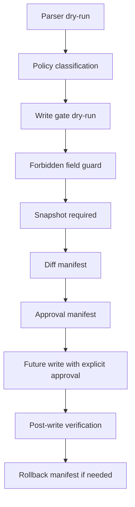

# BDB-PARSER-WRITE-GATE-0 - Design and Dry-Run

Nota BDB-PARSER-ROOT-ORG-0: el write gate operativo se movio a `MORNINGSTAR_PDF_PARSER/bin/prepare_write_gate_dry_run.js` y su libreria a `MORNINGSTAR_PDF_PARSER/src/lib/write_gate.js`. Para ejecuciones nuevas, usar `MORNINGSTAR_PDF_PARSER/SALIDA/` como salida visible del parser y `MORNINGSTAR_PDF_PARSER/artifacts/` para manifests tecnicos.

Fecha: 2026-05-07

Proyecto validado: `C:\Users\oanti\Documents\BDB-FONDOS`

Estado: `PARSER_WRITE_GATE_DRY_RUN_READY`

## Objetivo

Preparar un gate seguro para que los resultados del parser Morningstar solo puedan llegar a `funds_v3` despues de:

1. parser dry-run,
2. clasificacion por politica,
3. diff contra snapshot actual,
4. manifest de aprobacion,
5. snapshot/rollback manifest,
6. aprobacion humana explicita,
7. verificacion posterior.

Este bloque no ejecuta writes, no despliega y no toca `BDB-FONDOS-CORE`.

## Confirmaciones de Seguridad

- No se hizo deploy.
- No se hizo push.
- No se hizo commit.
- No se escribio en Firestore.
- No se llamo Gemini real.
- No se tocaron credenciales.
- No se modificaron retrocesiones.
- No se modifico mapping semantico.
- No se leyo ni modifico `C:\Users\oanti\Documents\BDB-FONDOS-CORE`.

## Archivos Creados

- `scripts/MORNINGSTAR_PDF_PARSER/lib/write_gate.js`
- `scripts/MORNINGSTAR_PDF_PARSER/prepare_write_gate_dry_run.js`
- `tests/parser_write_gate/test_parser_write_gate.js`
- `artifacts/bdb_parser_audit/write_gate/write_approval_manifest.json`
- `artifacts/bdb_parser_audit/write_gate/rollback_manifest.json`
- `artifacts/bdb_parser_audit/write_gate/post_write_verification_plan.json`
- `artifacts/bdb_parser_audit/write_gate/snapshot_manifest.json`
- `artifacts/bdb_parser_audit/write_gate/diff_manifest.json`

## Relacion con la Politica

La politica vigente esta definida en:

- `docs/BDB_PARSER_POLICY_0_WRITE_REVIEW_CANON.md`
- `artifacts/bdb_parser_audit/parser_policy_0_write_review_canon.json`

El gate respeta el contrato:

- `ACCEPT`: puede convertirse en candidato, nunca write automatico.
- `ACCEPT_WITH_WARNINGS`: puede convertirse en candidato si no hay campos prohibidos y hay snapshot/diff valido.
- `REVIEW`: no es candidato salvo aprobacion explicita por ISIN.
- `BLOCKED`: nunca es candidato.

## Campos Prohibidos

El parser write gate rechaza cualquier payload que intente tocar:

- `manual`
- `manual.costs`
- `manual.costs.retrocession`
- `portfolio_exposure_v2.economic_exposure`

Esto mantiene fuera del parser:

- retrocesiones,
- overrides manuales,
- costes manuales,
- economic exposure del pipeline S3 Python.

## Estados de Decision

- `WRITE_CANDIDATE`: payload apto para manifest, pendiente de aprobacion humana y write futuro.
- `REVIEW_REQUIRES_EXPLICIT_APPROVAL`: REVIEW sin `--approve-isin`.
- `BLOCKED_NEVER_WRITE`: BLOCKED por politica; no escribible.
- `SKIP_NO_CHANGE`: diff vacio.
- `SKIP_POLICY`: politica ausente, desconocida o limite de candidatos excedido.
- `SKIP_FORBIDDEN_FIELD`: payload intenta tocar campos prohibidos.
- `SKIP_MISSING_SNAPSHOT`: no hay snapshot actual, por tanto no se puede preparar write.
- `SKIP_DIFF_EMPTY`: no hay payload propuesto para comparar.

## Flujo del Gate



## Uso Dry-Run

```bash
node scripts/MORNINGSTAR_PDF_PARSER/prepare_write_gate_dry_run.js \
  --parser-artifact artifacts/bdb_parser_audit/parser_dry_run_latest.json \
  --classification artifacts/bdb_parser_audit/parser_dryrun_medium_policy_classification.json \
  --output-dir artifacts/bdb_parser_audit/write_gate \
  --max-write-candidates 5
```

Para aprobar un `REVIEW` en un futuro dry-run:

```bash
node scripts/MORNINGSTAR_PDF_PARSER/prepare_write_gate_dry_run.js \
  --approve-isin LU0000000000
```

Esa aprobacion solo lo convierte en posible candidato si tiene snapshot, diff no vacio y no toca campos prohibidos. Un `BLOCKED` sigue sin poder escribirse aunque se pase por `--approve-isin`.

## Resultado del Dry-Run Actual

Entrada:

- `parser_dry_run_latest.json`
- `parser_dryrun_medium_policy_classification.json`

Resultado:

- Total entradas evaluadas: 28
- `WRITE_CANDIDATE`: 0
- `REVIEW_REQUIRES_EXPLICIT_APPROVAL`: 9
- `BLOCKED_NEVER_WRITE`: 1
- `SKIP_MISSING_SNAPSHOT`: 18
- `write_executed`: false
- `dry_run`: true

La ausencia de candidatos es intencionada: en este bloque no se leyo Firestore real ni se proporciono snapshot offline. Sin snapshot actual no se puede generar un write seguro.

## Condiciones Para un Write Futuro

Antes de cualquier write real:

- generar snapshot actual por ISIN,
- generar diff revisable,
- excluir todos los `BLOCKED`,
- aprobar manualmente cada `REVIEW`,
- limitar el primer write a 3-5 ISINs,
- verificar que no aparecen campos prohibidos,
- confirmar rollback manifest,
- ejecutar post-write verification.

El futuro comando real debera requerir flags separados y explicitos. Este bloque no implementa ningun write activo.

## Relacion Futura con Configuracion/Admin

El modulo visual de `Configuracion` para administrador podra consumir estos manifests como capa de revision:

- listar candidatos,
- mostrar diff por ISIN,
- bloquear `BLOCKED`,
- pedir aprobacion explicita para `REVIEW`,
- mostrar snapshot y rollback antes de permitir cualquier accion.

El backend de Admin no deberia saltarse este gate.

## Tests Ejecutados

```bash
node --check scripts/MORNINGSTAR_PDF_PARSER/lib/write_gate.js
node --check scripts/MORNINGSTAR_PDF_PARSER/prepare_write_gate_dry_run.js
node tests/parser_write_gate/test_parser_write_gate.js
node scripts/MORNINGSTAR_PDF_PARSER/prepare_write_gate_dry_run.js --parser-artifact artifacts/bdb_parser_audit/parser_dry_run_latest.json --classification artifacts/bdb_parser_audit/parser_dryrun_medium_policy_classification.json --output-dir artifacts/bdb_parser_audit/write_gate --max-write-candidates 5
```

Resultado:

- Syntax checks: PASS
- Parser write gate tests: PASS
- Manifests dry-run: PASS
- Firestore writes: 0

## Decision

`PARSER_WRITE_GATE_DRY_RUN_READY`

Siguiente bloque recomendado: preparar `BDB-PARSER-WRITE-SNAPSHOT-1`, solo lectura, para generar snapshots actuales por un lote maximo de 3-5 ISINs y producir un diff real revisable sin ejecutar writes.
