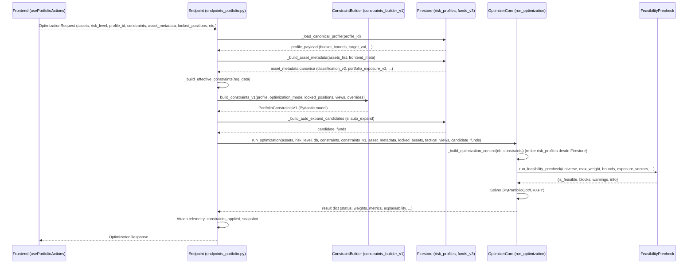

# Optimization Payload Contract Audit

## A. Resumen Ejecutivo

Este documento audita el contrato completo del flujo de optimización de carteras: desde el payload que construye el frontend (`buildOptimizationPayload` en `usePortfolioActions.ts`), pasando por el endpoint (`optimize_portfolio_quant` en `endpoints_portfolio.py`), el builder de restricciones (`build_constraints_v1`), hasta la respuesta final emitida por `run_optimization` en `optimizer_core.py`.

**Hallazgo principal:** El sistema funciona correctamente en producción, pero tiene **duplicación semántica significativa** entre campos legados y los contratos V1 canónicos. Varios campos se envían desde el frontend, son reconstruidos por el backend desde Firestore, y luego vuelven a ser sobreescritos por el builder. Esto genera un contrato implícito difícil de mantener y propenso a divergencias silenciosas.

**Estado actual:** Estable. Ningún campo duplicado provoca errores, pero el flujo de datos tiene rutas redundantes que dificultan la trazabilidad.

---

## B. Diagrama del Flujo Actual



> [!WARNING]
> **Doble lectura de Firestore:** `_load_canonical_profile` lee `risk_profiles` en el endpoint, y luego `_build_optimization_context` dentro de `run_optimization` vuelve a leer el mismo documento. Esto es redundante pero no dañino (dato idempotente).

---

## C. Tabla de Campos Request Actuales

### Enviados por `buildOptimizationPayload` (ruta principal)

| Campo | Origen | Consumidor Backend | Tipo | Canónico/Legacy | Riesgo | Recomendación |
|---|---|---|---|---|---|---|
| `assets` | Portfolio ISINs + VIPs | endpoint → optimizer | `string[]` | **Canónico** | Ninguno | Mantener |
| `risk_level` | UI slider (1-10) | endpoint (int cast + range check) | `number` | **Canónico** | Ninguno | Mantener como fuente primaria |
| `profile_id` | `String(riskLevel)` | endpoint → builder | `string` | **Derivado** ⚠️ | Redundancia con `risk_level` | Deprecar; derivar siempre en backend |
| `optimization_mode` | Hardcoded `"rebalance_to_profile"` | endpoint → builder | `string` | **Redundante** ⚠️ | También en `constraints.optimization_mode` | Enviar solo en un sitio |
| `locked_assets` | ISINs con `manualSwap` o `isLocked` + VIPs | endpoint → optimizer | `string[]` | **Canónico** | Ninguno | Mantener |
| `locked_positions.mode` | `"keep_money"` / `"keep_weight"` | endpoint → builder → optimizer | `LockMode` | **Canónico** | Ninguno | Mantener |
| `locked_positions.positions` | ISINs locked → peso fracción | endpoint → builder → optimizer | `Record<string,number>` | **Canónico** | Ninguno | Mantener |
| `asset_metadata` | Construida localmente desde `classification_v2.asset_type` | endpoint (merge con Firestore) | `Record<string, {asset_class, name}>` | **Hint/Legacy** ⚠️ | Backend reconstruye desde DB | Simplificar: enviar solo ISINs; backend obtiene todo |
| `constraints.apply_profile` | Hardcoded `true` | builder overrides | `boolean` | **Redundante** ⚠️ | Siempre true | Eliminar del frontend; backend lo infiere |
| `constraints.optimization_mode` | Hardcoded `"rebalance_to_profile"` | builder overrides | `string` | **Redundante** ⚠️ | Duplica `optimization_mode` raíz | Enviar solo uno |
| `constraints.lock_mode` | Derivado de strategy | builder overrides (fallback) | `LockMode` | **Legacy** ⚠️ | Duplica `locked_positions.mode` | Deprecar; usar solo `locked_positions.mode` |
| `constraints.fixed_weights` | Derivado de locked portfolio | builder overrides (fallback) | `Record<string,number>` | **Legacy** ⚠️ | Duplica `locked_positions.positions` | Deprecar; usar solo `locked_positions.positions` |
| `tactical_views` | Mapeo UI views → ISINs | endpoint → optimizer | `Record<string,number>` | **Canónico** | Ninguno | Mantener |
| `save_snapshot` | Debug/label global | endpoint (snapshot) | `boolean` | **Instrumental** | Ninguno | Mantener |
| `snapshot_label` | Debug/label global | endpoint (snapshot) | `string` | **Instrumental** | Ninguno | Mantener |

### Enviados solo en rutas de retry (payload manual, sin `buildOptimizationPayload`)

| Campo | Origen | Consumidor Backend | Tipo | Riesgo | Recomendación |
|---|---|---|---|---|---|
| `assets` | Expanded ISINs | endpoint | `string[]` | Ninguno | OK |
| `risk_level` | From hook closure | endpoint | `number` | Ninguno | OK |
| `locked_assets` | `manualSwap` only | endpoint | `string[]` | Pierde VIPs y `isLocked` | **Bug latente**: retry pierde locks |
| `auto_expand_universe` | Flag for equity floor | endpoint → builder | `boolean` | Ninguno | OK |
| ~~`profile_id`~~ | **Ausente** | endpoint defaults a `String(risk_level)` | — | Ninguno (backend infiere) | OK pero inconsistente |
| ~~`constraints`~~ | **Ausente** | endpoint gets `{}` | — | Backend uses all defaults | OK but less controlled |
| ~~`asset_metadata`~~ | **Ausente** | endpoint rebuilds from Firestore | — | Ninguno | OK (backend authority) |

> [!IMPORTANT]
> **Retry payloads son "pobres":** No incluyen `constraints`, `asset_metadata`, `locked_positions` ni `profile_id`. El backend suple las carencias con defaults, pero pierde contexto del usuario (locks, strategy mode). Esto es un **bug latente** si un usuario tiene fondos bloqueados y el retry los desbloquea silenciosamente.

---

## D. Tabla de Campos Response Actuales

### Emitidos por `run_optimization` (ruta `optimal`/`fallback`)

| Campo | Tipo | Status que lo emite | Frontend lo usa? | Canónico/Legacy | Recomendación |
|---|---|---|---|---|---|
| `api_version` | `string` | Todos | No | Instrumental | Mantener |
| `mode` | `string` | optimal/fallback | No | Derivado | Deprecar (redundante con explainability) |
| `status` | `string` | Todos | **Sí** (routing) | **Canónico** | **Tipar como enum** |
| `solver_path` | `string` | optimal/fallback | Sí (explainability) | Canónico | Mantener |
| `added_assets` | `string[]` | optimal/fallback | No | Informativo | Mantener |
| `used_assets` | `string[]` | optimal/fallback | Sí (mapeo pesos) | **Canónico** | Mantener |
| `missing_assets` | `string[]` | optimal/fallback | No | Informativo | Mantener |
| `portfolio_allocation` | `Record<string,number>` | optimal/fallback | No directamente | Informativo | Mantener |
| `weights` | `Record<string,number>` | Todos | **Sí** (core) | **Canónico** | Mantener |
| `metrics` | `{return, volatility, sharpe, rf_rate, portfolio, target_vol?, achieved_vol?, vol_deviation?}` | optimal/fallback | **Sí** (parcial) | **Canónico** | **Tipar completamente en frontend** |
| `frontier` | `Array<{x,y}>` | optimal/fallback | No directamente | Informativo | Mantener |
| `portfolio` | `{x,y}` | optimal/fallback | No | Redundante con `metrics.portfolio` | Deprecar raíz |
| `effective_start_date` | `string` | optimal/fallback | No | Informativo | Mantener |
| `observations` | `number` | Varios | Sí (error display) | Informativo | Mantener |
| `explainability` | `object` (complejo) | optimal/fallback | **Sí** (modal) | **Canónico** | Tipar con interfaz |
| `warnings` | `string[]` | Varios | Sí (display) | **Canónico** | Mantener |
| `message` | `string` | error/infeasible | Sí (display) | **Canónico** | Mantener |
| `error` | `string` | error | Sí (display) | Legacy | Unificar con `message` |
| `recovery_candidates` | `string[]` | infeasible | Sí (retry) | **Canónico** | Mantener |
| `feasibility` | `{requested, achievable, ...}` | infeasible_equity_floor | Sí (display) | **Canónico** | Mantener |
| `feasibility_precheck` | `{is_feasible, blocks, warnings, info}` | infeasible (precheck) | No directamente | **Canónico** | Mantener |
| `suggestion` | `string` | fallback_no_history | Sí (display) | **Canónico** | Mantener |
| `target_vol` | `number` | optimal/fallback (raíz) | ~~Sí~~ → ahora lee de `metrics` | **Legacy** ⚠️ | Deprecar raíz; solo en `metrics` |
| `achieved_vol` | `number` | optimal/fallback (raíz) | ~~Sí~~ → ahora lee de `metrics` | **Legacy** ⚠️ | Deprecar raíz; solo en `metrics` |
| `vol_deviation` | `number` | optimal/fallback (raíz) | ~~Sí~~ → ahora lee de `metrics` | **Legacy** ⚠️ | Deprecar raíz; solo en `metrics` |
| `fallback_reason` | `string` | fallback | Sí (display) | Canónico | Mantener |
| `taxonomy_telemetry` | `object` | Todos (injected by endpoint) | No | Instrumental | Mantener (debug) |
| `constraints_applied` | `object` | Todos (injected by endpoint) | No | Instrumental | Mantener (debug) |

---

## E. Propuesta: `OptimizationRequest` v2 (Contrato Limpio)

```typescript
interface OptimizationRequestV2 {
    // === CORE (obligatorios) ===
    assets: string[];                    // ISINs del universo del usuario
    risk_level: number;                  // 1-10, fuente canónica de perfil

    // === LOCKS (opcionales) ===
    locked_positions?: {
        mode: 'keep_weight' | 'keep_money' | 'min_keep' | 'free';
        positions: Record<string, number>;  // ISIN → fracción 0..1
    };

    // === PREFERENCIAS (opcionales, hints) ===
    tactical_views?: Record<string, number>;  // ISIN → tilt (-0.02..+0.02)
    auto_expand_universe?: boolean;           // Allow backend to add funds
    enable_challengers?: boolean;             // Inject top-sharpe challengers

    // === INSTRUMENTACIÓN (opcionales) ===
    save_snapshot?: boolean;
    snapshot_label?: string;
}
```

### Campos eliminados vs actual
| Campo eliminado | Razón |
|---|---|
| `profile_id` | Se deriva de `risk_level` en backend. Siempre eran `String(risk_level)` |
| `optimization_mode` (raíz) | Siempre `"rebalance_to_profile"`. Backend lo infiere. Si se necesita override, frontend envía un campo explícito `strategy_override` |
| `asset_metadata` | Backend reconstruye desde Firestore (fuente canónica). Frontend mandaba un subset pobre |
| `constraints` (flat object) | Sustituido por `locked_positions` canónico. `apply_profile` siempre true; `optimization_mode` derivado; `lock_mode` y `fixed_weights` duplicaban `locked_positions` |
| `constraints_v1` | Construido por el backend con `build_constraints_v1`. Frontend no debería pre-armarlo |
| `locked_assets` (flat `string[]`) | Derivable de `locked_positions.positions` (keys). Backend puede inferir |

---

## F. Propuesta: `OptimizationResponse` v2 (Contrato Limpio)

```typescript
type OptimizationStatus =
    | 'optimal'
    | 'fallback'
    | 'infeasible'
    | 'infeasible_equity_floor'
    | 'infeasible_constraints'
    | 'fallback_no_history'
    | 'auto_expand_failed'
    | 'error';

interface OptimizationMetrics {
    return: number;
    volatility: number;
    sharpe: number;
    rf_rate: number;
    portfolio_point: { x: number; y: number };
    target_vol?: number;
    achieved_vol?: number;
    vol_deviation?: number;
}

interface OptimizationExplainability {
    primary_objective: string;
    solver_fallback_used: boolean;
    binding_constraints: string[];
    solver_path?: string;
    optimization_mode: string;
    lock_mode: string;
    data_readiness: {
        universe_size: number;
        v2_exposure_assets: number;
        v2_identity_assets: number;
        legacy_only_assets: number;
    };
}

interface OptimizationResponseV2 {
    // === CORE (siempre presentes) ===
    status: OptimizationStatus;
    weights: Record<string, number>;
    metrics: OptimizationMetrics;
    used_assets: string[];
    explainability: OptimizationExplainability;
    warnings: string[];

    // === CONDICIONALES (según status) ===
    message?: string;              // Presente en error/infeasible
    recovery_candidates?: string[];  // Presente en infeasible
    feasibility?: {                  // Presente en infeasible_equity_floor
        requested: number;
        achievable: number;
    };
    feasibility_precheck?: {         // Presente si precheck bloqueó
        is_feasible: boolean;
        blocks: Array<{ code: string; severity: string; message: string; details: object }>;
    };
    suggestion?: string;             // Presente en fallback_no_history
    fallback_reason?: string;        // Presente en fallback
    added_assets?: string[];         // Presente si auto-expand
    solver_path?: string;            // Duplica explainability.solver_path para compat
    observations?: number;           // Presente en error/short data

    // === DEBUG (opcionales) ===
    api_version?: string;
    frontier?: Array<{ x: number; y: number }>;
    portfolio_allocation?: Record<string, number>;
    taxonomy_telemetry?: object;
    constraints_applied?: object;
}
```

---

## G. Campos a Deprecar Gradualmente

| Campo | Ubicación | Acción | Timeline |
|---|---|---|---|
| `profile_id` en request | Frontend → Backend | Backend always derives from `risk_level` | Fase 1 |
| `optimization_mode` en request (raíz) | Frontend → Backend | Remove; backend infers from profile | Fase 1 |
| `constraints.optimization_mode` | Frontend → Backend | Merged into builder; remove from FE | Fase 1 |
| `constraints.lock_mode` | Frontend → Backend | Use `locked_positions.mode` exclusively | Fase 1 |
| `constraints.fixed_weights` | Frontend → Backend | Use `locked_positions.positions` exclusively | Fase 1 |
| `constraints.apply_profile` | Frontend → Backend | Always true; remove from FE | Fase 1 |
| `asset_metadata` en request | Frontend → Backend | Backend always rebuilds from Firestore | Fase 2 |
| `target_vol`/`achieved_vol`/`vol_deviation` en raíz response | Backend → Frontend | Keep only in `metrics` sub-object | Fase 2 |
| `portfolio` point en raíz response | Backend → Frontend | Keep only in `metrics.portfolio_point` | Fase 2 |
| `mode` en response | Backend → Frontend | Remove; use `explainability.optimization_mode` | Fase 2 |
| `error` en response | Backend → Frontend | Unify with `message` | Fase 2 |

---

## H. Validaciones Recomendadas

### Backend (endpoint)
1. **`risk_level`**: Ya validado (int, 1-10). ✅
2. **`assets`**: Ya validado (non-empty). ✅
3. **`profile_id` consistency**: Si recibido, backend debería loguear warning si difiere de `String(risk_level)`.
4. **`locked_positions.positions`**: Validar que todos los ISINs existan en `assets[]`.
5. **`auto_expand_universe`**: Validar booleano.

### Frontend (pre-envío)
1. **`weights` sum**: Validar que `locked_positions.positions` no sume >1.0 antes de enviar.
2. **Retry payloads**: Incluir `locked_positions` y `constraints` en retries para no perder contexto.

---

## I. Riesgos de Migración

| Riesgo | Severidad | Mitigación |
|---|---|---|
| **Retry payloads pierden locks** | Media | Reconstruir retry payload con `buildOptimizationPayload` adaptado |
| **`asset_metadata` removal**: Si backend falla leyendo Firestore, pierde fallback | Baja | Backend ya tiene fallback con frontend meta merge (mantener temporalmente) |
| **Frontend asume campos raíz response**: Código antiguo podría leer `result.target_vol` | Baja | Ya mitigado con `??` fallback en commit 1f200d0 |
| **Snapshot recordings contienen campos legacy**: Estructura interna de auditoría | Muy baja | Los snapshots son append-only, no críticos |
| **Doble lectura Firestore `risk_profiles`**: Endpoint + optimizer_core | Muy baja | Rendimiento (~2ms), no funcional |

---

## J. Quick Wins Sin Implementar

1. **Fix retry payloads (Frontend)**: Usar `buildOptimizationPayload` (o una variante) para todos los retries, no un objeto manual pobre. Esto restaura locks, profile_id, constraints, y asset_metadata. ~15 min de trabajo.

2. **Tipar `status` como enum (Frontend)**: Añadir `OptimizationStatus` type en `types/index.ts` y usarlo en `SmartPortfolioResponse.status`. ~5 min.

3. **Eliminar `constraints.fixed_weights` + `constraints.lock_mode` del frontend**: El builder ya lee de `locked_positions` primero. Eliminar duplicación del payload reduce superficie de bugs. ~10 min.

4. **Unificar `error`/`message` en response (Backend)**: Usar solo `message` en todas las rutas de error/infeasible. ~5 min.

5. **Log warning si `profile_id != String(risk_level)` (Backend)**: Detectar divergencia silenciosa. ~2 min.

---

## K. Prompt Recomendado para Implementar Fase 1

Si el usuario aprueba:

```
AGENTE: [modelo] en Antigravity IDE

TAREA: Implementar Fase 1 de limpieza del contrato OptimizationRequest.

REGLAS:
- NO tocar backend excepto logging adicional.
- NO tocar firestore.rules.
- NO tocar credenciales.
- NO hacer deploy.
- NO hacer push sin aprobación.

CAMBIOS:
1. Frontend (usePortfolioActions.ts):
   a. Eliminar `profile_id`, `optimization_mode`, `constraints.apply_profile`,
      `constraints.optimization_mode`, `constraints.lock_mode`,
      `constraints.fixed_weights` del payload de `buildOptimizationPayload`.
      Mantener solo: assets, risk_level, locked_positions, tactical_views,
      save_snapshot, snapshot_label, asset_metadata (temporalmente).
   b. Refactorizar los 3 retry payloads (infeasible, equity_floor,
      fallback_no_history) para que utilicen buildOptimizationPayload o
      al menos incluyan locked_positions y risk_level correctamente.
   c. Tipar SmartPortfolioResponse.status como OptimizationStatus enum.

2. Frontend (types/index.ts):
   a. Crear tipo OptimizationStatus.
   b. Actualizar OptimizationRequest eliminando campos deprecados.
   c. Documentar campos opcionales con JSDoc.

3. Backend (endpoints_portfolio.py):
   a. Añadir log warning si profile_id recibido difiere de String(risk_level).
   b. Verificar que el builder sigue funcionando con payload simplificado
      (ya lo hace, solo confirmar).

4. Tests:
   a. npm run build en frontend.
   b. Ejecutar tests backend existentes.

COMMIT: refactor(contract): simplify OptimizationRequest payload phase 1
```

---

## Respuestas a las 12 Preguntas

### 1. ¿Campo canónico de perfil: `risk_level` o `profile_id`?
**`risk_level`** (number 1-10). `profile_id` es siempre `String(risk_level)` en el frontend. El backend debería derivarlo internamente.

### 2. ¿Qué ocurre si ambos difieren?
El backend usa `profile_id` para buscar el perfil en Firestore. Si difieren, el perfil real correspondería a `profile_id`, ignorando silenciosamente `risk_level` para la política de buckets. **Riesgo: bajo** (actualmente nunca difieren).

### 3. ¿Dónde se decide `optimization_mode`?
En cascada: `req_data.optimization_mode` → `constraints.optimization_mode` → `"rebalance_to_profile"`. Luego el builder puede override a `max_sharpe` para perfiles ≥8.

### 4. ¿Duplicidad entre `optimization_mode` raíz y `constraints.optimization_mode`?
**Sí, total.** Frontend envía el mismo valor (`"rebalance_to_profile"`) en ambos sitios. Backend lee primero raíz, luego constraints como fallback.

### 5. ¿`locked_positions` y `fixed_weights` son equivalentes?
**Sí, semánticamente idénticos.** `locked_positions.positions` es la versión canónica; `constraints.fixed_weights` es el legacy. El builder lee primero de `locked_positions` y cae a `fixed_weights` como fallback.

### 6. ¿`asset_metadata` del frontend se usa, se ignora o se mergea?
**Se mergea con prioridad DB.** El backend descarga metadata completa desde `funds_v3`, y solo usa el frontend metadata como fallback para ISINs que no están en DB. En la práctica, todos los ISINs del universo están en DB, así que el frontend metadata es **efectivamente ignorado**.

### 7. ¿Qué debe recalcular backend desde Firestore?
- Perfil canónico (bucket_bounds, target_vol) → `system_settings/risk_profiles`
- Metadata de activos (classification_v2, portfolio_exposure_v2) → `funds_v3/{isin}`
- Candidatos de auto-expand → `funds_v3` (top Sharpe)

### 8. ¿Qué campos del frontend deben considerarse solo hints?
- `asset_metadata`: hint, backend reconstruye
- `optimization_mode`: hint (backend siempre override para perfiles altos)
- `constraints.apply_profile`: siempre true, no es realmente una decisión del usuario

### 9. ¿Qué campos de respuesta deben quedar tipados obligatoriamente?
- `status` (como enum)
- `weights`
- `metrics` (con sub-tipado completo)
- `explainability` (al menos `primary_objective`, `binding_constraints`, `solver_fallback_used`)
- `used_assets`
- `warnings`

### 10. ¿Campos legacy a mantener temporalmente?
- `target_vol`/`achieved_vol`/`vol_deviation` en raíz response (ya mitigado con `??` fallback)
- `error` en response (duplica `message`)
- `asset_metadata` en request (safety net)

### 11. ¿Riesgos si se limpia de golpe?
El mayor riesgo es **romper los retry payloads**, que actualmente envían objetos manuales sin `constraints` ni `locked_positions`. Si el backend empieza a rechazar payloads sin `constraints`, los retries fallarán. **Mitigación:** backend ya maneja defaults vacíos correctamente.

### 12. ¿Migración gradual recomendada?
- **Fase 1** (Frontend-only): Limpiar payload, tipear response, arreglar retries. ~1 hora.
- **Fase 2** (Backend-light): Eliminar campos raíz duplicados en response, unificar error/message, log warnings. ~30 min.
- **Fase 3** (Contract enforcement): Backend rechaza campos legacy con deprecation warning header. ~2 horas.
