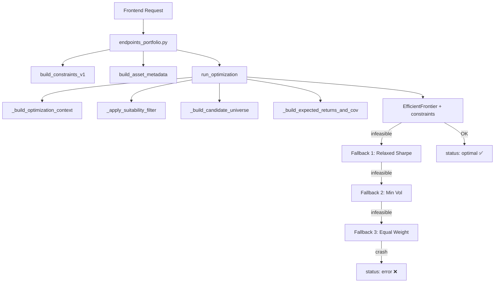

# Diseño: Pre-Check de Factibilidad del Optimizador

**Fecha:** 2026-05-05  
**Estado:** Diseño — no implementado  
**Autor:** Antigravity (Claude 4.6)

---

## A. Resumen Ejecutivo

Este documento diseña una capa de validación **determinista, pura y testeable** que se ejecuta *antes* de invocar al solver (PyPortfolioOpt/CVXPY) para detectar configuraciones imposibles o peligrosamente estrechas. El objetivo es evitar que el solver devuelva errores opacos (`infeasible`, `error`) cuando el problema es detectable con aritmética simple, y proporcionar al asesor/banca privada mensajes claros y accionables.

**No sustituye al solver.** Complementa la cadena existente interceptando casos que siempre fallarían.

---

## B. Problemas Actuales

### B.1 Errores opacos del solver
Cuando `EfficientFrontier.max_sharpe()` o `.efficient_risk()` fallan, PyPortfolioOpt devuelve:
```
('Please check your objectives/constraints or use a different solver.', 'Solver status: infeasible')
```
No hay indicación de *qué* constraint causó el conflicto.

### B.2 Mapa de infeasibilidad observada

| Escenario | Causa raíz | Frecuencia estimada |
|-----------|-----------|---------------------|
| Universo < ceil(1/max_weight) activos | `sum(weights) == 1` imposible con `w_i ≤ max_weight` | Alta en carteras pequeñas |
| Perfil P8-P10 sin equity pura | `equity ≥ 0.85` pero solo hay mixtos/RF | Alta |
| `sum(bucket_mins) > 1.0` | Contradicción aritmética entre pisos | Media (perfiles legacy) |
| `sum(bucket_maxs) < 1.0` | Contradicción aritmética entre techos | Baja |
| `fixed_weights > 1.0` | Posiciones bloqueadas suman > 100% | Baja |
| `fixed_weights` incompatible con bucket bounds | Lock de RF a 50% + bucket equity ≥ 85% | Media |
| `target_vol` inalcanzable | Portfolio solo de equity (vol ~18%) pero target_vol = 2.5% | Media (P1-P3 con poca RF) |
| Universo vacío tras suitability filter | Todos excluidos por idoneidad | Rara |

### B.3 Flujo actual sin pre-check



El pre-check se insertaría **entre I y J** — después de tener `mu`, `S`, `universe`, exposure vectors y constraints resueltos, pero antes de construir el `EfficientFrontier`.

---

## C. Datos Disponibles Antes del Solver

En el punto de inserción (`optimizer_core.py` ~L975, tras FASE 5), están disponibles:

| Variable | Tipo | Contenido |
|----------|------|-----------|
| `universe` | `list[str]` | ISINs que sobrevivieron al filtro de datos |
| `eq_vec, bd_vec, cs_vec, al_vec, ra_vec, ot_vec` | `np.ndarray` | Exposición por bucket para cada activo (escala 0..1) |
| `max_weight` | `float` | Peso máximo individual (default 0.20) |
| `min_weight` | `float` | Peso mínimo individual |
| `apply_profile` | `bool` | Si se aplican restricciones de perfil |
| `risk_level_i` | `int` | Nivel de riesgo 1-10 |
| `current_risk_buckets` | `dict` | Bandas por bucket por perfil |
| `bucket_bounds_v1` | `dict` | Constraints canónicos v1 |
| `locked_assets` | `list` | Activos bloqueados |
| `fixed_weights` | `dict` | Pesos fijos para activos bloqueados |
| `lock_mode` | `str` | Tipo de bloqueo |
| `rf_rate` | `float` | Tasa libre de riesgo |
| `mu` | `pd.Series` | Expected returns |
| `S` | `pd.DataFrame` | Covariance matrix |
| `objective` | `str` | Objetivo del solver |
| `risk_budget` | `dict` | target_vol, vol_band, target_return |

---

## D. Validaciones Propuestas

### D.1 🛑 BLOCK — Infeasibilidad determinista (impiden ejecución del solver)

#### BLOCK-1: Universo insuficiente para max_weight
```
min_assets_needed = ceil(1.0 / max_weight)
if len(universe) < min_assets_needed:
    BLOCK → "Se necesitan al menos {N} fondos con max_weight={max_weight*100}%,
             pero solo hay {len(universe)} disponibles."
```
**Datos:** `universe`, `max_weight`  
**Ejemplo:** `max_weight=0.20` → necesita ≥6 activos. Si solo hay 4 → BLOCK.

#### BLOCK-2: Suma de pisos de bucket > 100%
```
active_bounds = bucket_bounds_v1 if v1_active else current_risk_buckets[risk_level_i]
sum_mins = sum(min for min in active_mins if min is not None)
if sum_mins > 1.0 + epsilon:
    BLOCK → "Los mínimos de bucket suman {sum_mins*100}% > 100%.
             Imposible satisfacer todos los pisos simultáneamente."
```
**Datos:** `bucket_bounds_v1` o `current_risk_buckets`, exposure vectors.

#### BLOCK-3: Suma de techos de bucket < 100%
```
sum_maxs = sum(max for max in active_maxs if max is not None)
# Solo los buckets con max definido; si un bucket no tiene max, asumimos 1.0
effective_maxs = [max if max is not None else 1.0 for ...]
if sum(effective_maxs) < 1.0 - epsilon:
    BLOCK → "Los máximos de bucket suman {sum*100}% < 100%.
             No es posible asignar todo el capital."
```

#### BLOCK-4: Fixed weights > remaining budget
```
total_fixed = sum(fixed_weights.values())
if total_fixed > 1.0 + epsilon:
    BLOCK → "Los pesos bloqueados suman {total_fixed*100}% > 100%.
             No queda presupuesto para optimizar."
```
**Datos:** `fixed_weights`, `lock_mode`.

#### BLOCK-5: Universo vacío
```
if len(universe) == 0:
    BLOCK → "No hay activos válidos tras el filtro de datos e idoneidad."
```

#### BLOCK-6: Exposición inalcanzable (bucket no representado)
```
for bucket, min_req in active_mins.items():
    if min_req > 0 and max_exposure(universe, bucket_vec) == 0:
        BLOCK → "El perfil requiere mínimo {min_req*100}% en {bucket},
                 pero ningún fondo del universo tiene exposición a {bucket}."
```
**Datos:** `eq_vec`, `bd_vec`, etc. + `bucket_bounds_v1` o `current_risk_buckets`.  
**Ejemplo:** Perfil P9 (equity_min=0.95) pero el universo solo tiene fondos RF.

### D.2 ⚠️ WARNING — Riesgo alto de infeasibilidad (solver podría fallar)

#### WARN-1: Budget libre insuficiente para diversificación
```
remaining_budget = 1.0 - sum(fixed_weights.values())
free_assets = len(universe) - len(locked_assets)
if free_assets > 0 and remaining_budget / free_assets < min_weight:
    WARN → "El presupuesto libre ({remaining*100}%) repartido entre {free} fondos
             da {per_asset*100}% por fondo, menor que min_weight ({min_weight*100}%)."
```

#### WARN-2: Target vol probablemente inalcanzable
```
if objective == "efficient_risk":
    portfolio_vol_range = (min(diag(S)**0.5), max(diag(S)**0.5))
    if target_vol < portfolio_vol_range[0] * 0.7:
        WARN → "target_vol ({tv*100}%) es muy inferior a la vol mínima del universo
                ({min_vol*100}%). El solver probablemente fallará."
    if target_vol > portfolio_vol_range[1] * 1.3:
        WARN → "target_vol ({tv*100}%) supera ampliamente la vol máxima del universo."
```

#### WARN-3: Constraints apretados (margin < 5%)
```
margin = 1.0 - sum_mins  # Espacio libre tras satisfacer pisos
if 0 < margin < 0.05:
    WARN → "Margen de optimización muy estrecho ({margin*100}%).
             El solver tiene poco espacio para diversificar."
```

#### WARN-4: Locked weights + bucket bounds incompatibles
```
for bucket, min_req in active_mins.items():
    locked_in_bucket = sum(fixed_weights[a] * bucket_vec[i] for locked a in bucket)
    if locked_in_bucket > max_req:
        WARN → "Activos bloqueados aportan {locked*100}% a {bucket},
                superando el máximo permitido ({max*100}%)."
```

### D.3 ℹ️ INFO — Transparencia (no bloquean, solo informan)

#### INFO-1: Perfil agresivo con objective override
```
if risk_level_i >= 8 and objective_was_overridden_to_max_sharpe:
    INFO → "Perfil agresivo: se usa max_sharpe en lugar de efficient_risk."
```
*(Ya existe en `constraints_builder_v1.py` L208-213.)*

#### INFO-2: Activos excluidos por historial
```
if missing_assets:
    INFO → "{N} fondos excluidos por historial insuficiente: {list}."
```
*(Ya existe en `_build_candidate_universe`.)*

#### INFO-3: Deduplicación de bucket constraints activa
```
if v1_active and profile_skipped:
    INFO → "Constraints canónicos v1 aplicados; perfil legacy omitido."
```
*(Ya existe tras commit 5663eae.)*

---

## E. Contrato de Salida Recomendado

```python
@dataclass
class FeasibilityResult:
    feasible: bool               # True si no hay BLOCKs
    blocks: list[FeasibilityIssue]    # Problemas fatales
    warnings: list[FeasibilityIssue]  # Riesgo alto
    info: list[FeasibilityIssue]      # Transparencia

@dataclass
class FeasibilityIssue:
    code: str        # e.g. "BLOCK_UNIVERSE_TOO_SMALL"
    severity: str    # "block" | "warning" | "info"
    message_es: str  # Mensaje en español para asesor
    message_en: str  # Mensaje en inglés para logs
    details: dict    # Datos cuantitativos para debugging
```

**Contrato de uso en `run_optimization`:**

```python
# Tras FASE 5, antes de construir EfficientFrontier:
precheck = run_feasibility_precheck(
    universe, eq_vec, bd_vec, cs_vec, al_vec, ra_vec, ot_vec,
    max_weight, min_weight, apply_profile, risk_level_i,
    current_risk_buckets, bucket_bounds_v1,
    locked_assets, fixed_weights, lock_mode,
    objective, risk_budget, mu, S
)

if not precheck.feasible:
    return {
        "status": "infeasible",
        "message": precheck.blocks[0].message_es,
        "feasibility": {
            "blocks": [b.to_dict() for b in precheck.blocks],
            "warnings": [w.to_dict() for w in precheck.warnings],
        },
        "weights": {},
        "explainability": {...}
    }

# Si hay warnings, continuar pero adjuntarlos al resultado
warnings_list = [w.message_es for w in precheck.warnings]
```

---

## F. Ubicación Arquitectónica Recomendada

### Opción recomendada: Nuevo módulo `feasibility_precheck.py`

```
functions_python/services/portfolio/
├── constraints_builder_v1.py    # Construye constraints
├── feasibility_precheck.py      # 🆕 Valida factibilidad pre-solver
├── optimizer_core.py            # Motor principal
├── suitability_engine.py        # Filtro regulador
└── utils.py                     # Utilidades compartidas
```

**Justificación:**
- No contamina `optimizer_core.py` (ya tiene ~1188 líneas).
- No pertenece a `constraints_builder_v1.py` (que *construye*, no *valida*).
- Es puro: no accede a DB, no depende de Firebase.
- Es testeable unitariamente con datos sintéticos.
- Mismo nivel que `suitability_engine.py` (filtro pre-solver).

**Invocación:** Desde `run_optimization()` en `optimizer_core.py`, entre FASE 5 y FASE 6.

---

## G. Mensajes Recomendados para Frontend

| Código | Mensaje (ES) para asesor |
|--------|-------------------------|
| `BLOCK_UNIVERSE_TOO_SMALL` | "Universo insuficiente: se necesitan al menos {N} fondos para diversificar con un peso máximo del {max_weight}%, pero solo hay {actual} disponibles." |
| `BLOCK_BUCKET_MINS_EXCEED_100` | "Los mínimos de inversión por categoría suman {sum}%, superando el 100% del capital. Revise los límites del perfil." |
| `BLOCK_BUCKET_MAXS_BELOW_100` | "Los máximos de inversión por categoría suman solo {sum}%, impidiendo asignar todo el capital." |
| `BLOCK_FIXED_WEIGHTS_EXCEED_100` | "Las posiciones bloqueadas consumen el {sum}% del capital. No queda presupuesto para optimizar." |
| `BLOCK_EMPTY_UNIVERSE` | "No quedan fondos válidos tras aplicar los filtros de idoneidad e historial." |
| `BLOCK_BUCKET_NOT_REPRESENTABLE` | "El perfil requiere al menos {min}% en {bucket}, pero ningún fondo disponible tiene exposición a esa categoría." |
| `WARN_TIGHT_MARGIN` | "Margen de optimización estrecho ({margin}%). La solución puede ser subóptima." |
| `WARN_TARGET_VOL_UNLIKELY` | "La volatilidad objetivo ({tv}%) puede no ser alcanzable con los fondos disponibles (rango: {min_v}%-{max_v}%)." |
| `WARN_LOCKED_VS_BUCKET` | "Las posiciones bloqueadas aportan {locked}% a {bucket}, superando el máximo permitido ({max}%)." |

**Integración con UX fallback ya desplegada:**
- Los mensajes BLOCK devuelven `status: "infeasible"` (nuevo status) en vez de `"error"`.
- El frontend ya maneja `status: "fallback"` con toast warning.
- Se puede extender el modal de "Propuesta Alternativa" para mostrar el motivo de infeasibilidad.

---

## H. Tests Mínimos Propuestos

### Nuevo archivo: `tests/test_feasibility_precheck.py`

| # | Test | Tipo | Descripción |
|---|------|------|-------------|
| 1 | `test_block_universe_too_small` | BLOCK | 3 assets, max_weight=0.20 → BLOCK |
| 2 | `test_pass_universe_sufficient` | PASS | 6 assets, max_weight=0.20 → OK |
| 3 | `test_block_bucket_mins_exceed_100` | BLOCK | equity_min=0.60, bond_min=0.50 → sum=1.10 → BLOCK |
| 4 | `test_block_bucket_maxs_below_100` | BLOCK | equity_max=0.30, bond_max=0.30 → sum=0.60 < 1.0 → BLOCK |
| 5 | `test_block_fixed_weights_exceed_100` | BLOCK | 3 locked at 40% each → 120% → BLOCK |
| 6 | `test_block_empty_universe` | BLOCK | 0 assets → BLOCK |
| 7 | `test_block_bucket_not_representable` | BLOCK | equity_min=0.85, all assets are bond → BLOCK |
| 8 | `test_warn_tight_margin` | WARN | sum_mins=0.97 → margin 3% → WARN |
| 9 | `test_warn_target_vol_unlikely` | WARN | target_vol=0.025, all equity (vol ~18%) → WARN |
| 10 | `test_warn_locked_vs_bucket` | WARN | Lock RF=50%, equity_min=0.85 → WARN |
| 11 | `test_pass_normal_p5` | PASS | Perfil 5 estándar, 10 fondos diversificados → 0 blocks, 0 warnings |
| 12 | `test_pass_aggressive_p10` | PASS | Perfil 10, 8 equity + 2 bond → OK |
| 13 | `test_info_messages_present` | INFO | Verificar que INFO se genera para casos normales |

---

## I. Riesgos de Falsos Positivos

| Riesgo | Mitigación |
|--------|------------|
| BLOCK por universo insuficiente pero el solver podría relajar max_weight | Pre-check usa el max_weight *efectivo* (incluyendo overrides), no el default |
| BLOCK por bucket no representable pero Mixtos aportan exposición parcial | Usar exposición *continua* (`eq_vec`) en vez de clasificación binaria |
| WARN por target_vol inalcanzable pero BL/views cambian los returns | WARN no bloquea; el solver sigue intentando |
| Falso positivo en sum_maxs < 1.0 si hay buckets sin max definido | Asumir max=1.0 para buckets sin max explícito |

---

## J. Plan de Implementación por Fases

### Fase 1 — Mínimo Viable (BLOCK críticos)
- Crear `feasibility_precheck.py` con BLOCK-1 a BLOCK-6.
- Integrar en `run_optimization()` como early-return.
- Crear `test_feasibility_precheck.py` (tests 1-7, 11-12).
- Devolver `status: "infeasible"` con payload explicativo.
- **Estimación:** 1-2 horas.

### Fase 2 — Warnings
- Añadir WARN-1 a WARN-4.
- Adjuntar warnings al resultado sin bloquear.
- Añadir tests 8-10, 13.
- **Estimación:** 1 hora.

### Fase 3 — Frontend integration
- Extender modal de fallback para mostrar motivos de infeasibilidad.
- Añadir toast específico para "infeasible" (diferente de "fallback").
- **Estimación:** 1-2 horas.

---

## K. Prompt Recomendado para Implementar Fase 1

```
AGENTE: Claude 4.6 en Antigravity IDE

TAREA: Implementar Fase 1 del pre-check de factibilidad del optimizador.

REGLAS ESTRICTAS:
- NO tocar frontend.
- NO tocar firestore.rules.
- NO tocar credenciales.
- NO cambiar política de asset allocation.
- NO cambiar perfiles 1-10.
- NO cambiar objective/fallback chain.
- NO hacer deploy.
- NO hacer push sin aprobación.
- Cambios mínimos y testeables.

DISEÑO:
Ver docs/OPTIMIZER_FEASIBILITY_PRECHECK_DESIGN.md secciones D.1, E, F.

ARCHIVOS A CREAR:
1. functions_python/services/portfolio/feasibility_precheck.py
   - Función run_feasibility_precheck(...)
   - 6 validaciones BLOCK (BLOCK-1 a BLOCK-6).
   - Devuelve FeasibilityResult con blocks, warnings, info.
   - Puro: sin I/O, sin Firebase, sin imports pesados.

2. functions_python/tests/test_feasibility_precheck.py
   - Tests 1-7, 11-12 del diseño.
   - Todos con datos sintéticos.

ARCHIVO A MODIFICAR:
3. functions_python/services/portfolio/optimizer_core.py
   - Insertar llamada a run_feasibility_precheck entre FASE 5 y FASE 6.
   - Si no es feasible, devolver status "infeasible" con payload.
   - No alterar el resto del flujo.

VALIDACIÓN:
python -m pytest tests/test_feasibility_precheck.py tests/test_optimizer_core.py tests/test_optimizer_invariants.py tests/test_bucket_constraints_dedup.py -v

ENTREGABLE:
Mostrar git status, git diff --stat y resultado de tests antes de pedir aprobación para commit.
```
