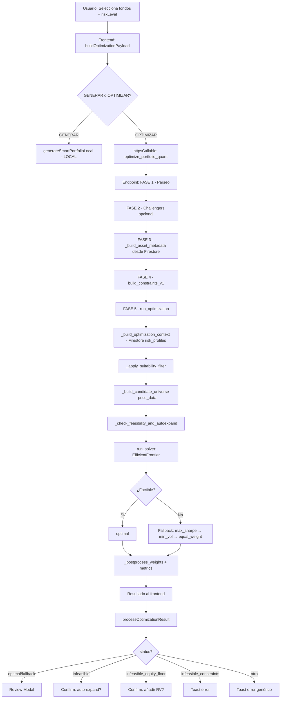

# Auditoría End-to-End: Lógica del Programa BDB-FONDOS

**Fecha:** 2026-05-04  
**Alcance:** Frontend → Payload → Backend → Optimizer → Resultado  
**Estado:** Solo análisis. Ningún código modificado.

---

## A. Resumen Ejecutivo

BDB-FONDOS implementa un sistema de gestión de carteras con optimización cuantitativa basada en PyPortfolioOpt (Markowitz). El flujo cubre selección de fondos → restricciones → solver → presentación.

**Veredicto general:** La arquitectura es sólida para perfiles 1–7. Los perfiles 8–10 presentan infeasibilidad matemática recurrente. Existen **3 bugs críticos**, **5 inconsistencias medias** y **4 mejoras recomendadas**.

| Área | Estado |
|---|---|
| Frontend → Backend contract | ⚠️ Duplicación de campos y redundancias |
| Constraints pipeline | 🔴 Doble inyección + "Mixto" sin mapear |
| Perfiles 1–7 | ✅ Factibles y coherentes |
| Perfiles 8–10 | ❌ `efficient_risk` + target_vol imposible |
| Suitability engine | ✅ Robusto (requiere classification_v2) |
| Fallback chain | ✅ Funcional tras fix reciente |
| UX/resultado | ⚠️ No distingue fallback vs optimal con detalle |

---

## B. Mapa Completo del Flujo



---

## C. Tabla Frontend → Payload → Backend → Optimizer

### C.1 Payload enviado por Frontend

| Campo | Tipo | Fuente | Backend lo usa? | Notas |
|---|---|---|---|---|
| `assets` | string[] | portfolio ISINs + VIPs | ✅ Sí | Universo inicial |
| `risk_level` | number | Slider UI | ✅ Sí | 1-10 |
| `profile_id` | string | = riskLevel | ✅ Sí | **Duplica risk_level** |
| `optimization_mode` | string | Hardcoded "rebalance_to_profile" | ✅ Sí | |
| `locked_assets` | string[] | portfolio locked+VIPs | ✅ Sí | |
| `locked_positions` | {mode, positions} | Calculated | ✅ Sí | |
| `asset_metadata` | dict | Frontend classification | ⚠️ Parcial | Backend re-descarga de Firestore |
| `constraints` | dict | Hardcoded defaults | ✅ Sí | |
| `constraints.apply_profile` | bool | true siempre | ✅ Sí | |
| `constraints.optimization_mode` | string | Duplica campo raíz | ⚠️ Redundante | |
| `constraints.lock_mode` | string | keep_weight/keep_money | ✅ Sí | **Duplica locked_positions.mode** |
| `constraints.fixed_weights` | dict | Pesos bloqueados | ✅ Sí | **Duplica locked_positions.positions** |
| `tactical_views` | dict | Solo si hay views | ✅ Sí | |
| `save_snapshot` | bool | Opcional | ✅ Sí | |
| `enable_challengers` | bool | No enviado (default false) | ✅ Sí | Disabled by default |

### C.2 Campos que Backend ignora o re-calcula

| Campo Frontend | Acción Backend |
|---|---|
| `asset_metadata` | Re-descarga de Firestore, merge con frontend como fallback |
| `constraints.optimization_mode` | Sobreescrito por build_constraints_v1 |
| `profile_id` vs `risk_level` | Ambos usados, potencialmente contradictorios |

---

## D. Auditoría de Filtros Frontend

### D.1 GENERAR (Local)

`generateSmartPortfolioLocal()` en `rulesEngine.ts`:

1. **Filtro de calidad:** `data_quality.has_history`, `metrics_invalid`, `history_ok`.
2. **Filtro de historial:** ≥756 puntos (~3 años) o ≥3 años via `yearsHistory`.
3. **Filtro de suitability:** `isFundSuitableForProfile()` — réplica local del backend.
4. **Clasificación en buckets:** `getAssetClass()` usando classification_v2, exposure, fallback a "Otros".
5. **Target %:** Media de min/max por bucket, normalizado a 100%.
6. **Selección:** Top-scored por bucket, dedup por nombre base.
7. **Pesos:** Equal-weight por bucket.

**Problemas:**
- ⚠️ La clasificación local puede diferir de la del backend (diferentes funciones de mapping).
- ⚠️ `getAssetClass()` tiene lógica heurística que el backend no replica exactamente.
- ✅ Se documenta explícitamente como "PRESENTATION ONLY".

### D.2 OPTIMIZAR (Backend)

`buildOptimizationPayload()` en `usePortfolioActions.ts`:

1. **Universo:** portfolio ISINs + VIPs.
2. **Locked:** portfolio locked/manualSwap + VIPs.
3. **Metadata:** Se envía `asset_class` y `name` del frontend, pero backend lo sobreescribe con Firestore.

**Diferencias clave GENERAR vs OPTIMIZAR:**

| Aspecto | GENERAR | OPTIMIZAR |
|---|---|---|
| Motor | Local (rulesEngine.ts) | Remoto (optimizer_core.py) |
| Solver | Equal-weight por bucket | PyPortfolioOpt EfficientFrontier |
| Suitability | Réplica frontend | Canónica backend |
| Constraints | Buckets min/max (local) | Buckets + exposure + geo + locks |
| Resultado | Borrador | Propuesta optimizada |

---

## E. Auditoría de Payload

### E.1 Redundancias

1. **`risk_level` vs `profile_id`:** El frontend envía ambos como el mismo valor. El backend usa `profile_id` para cargar perfil de Firestore y `risk_level` para el solver. Si difieren → comportamiento impredecible.

2. **`optimization_mode`:** Enviado a nivel raíz Y dentro de `constraints`. El backend usa `build_constraints_v1` que toma el de `overrides` (que incluye el de `constraints`). Resultado: el campo raíz puede ser ignorado.

3. **`lock_mode` + `fixed_weights`:** Enviados dentro de `constraints` Y como `locked_positions.mode` + `locked_positions.positions`. Backend intenta reconciliar ambos en `_resolve_locks()`.

### E.2 Campos no validados

- `constraints.apply_profile` siempre `true` desde frontend → backend nunca recibe `false` en operación normal, pero el backend tiene lógica para `pure_markowitz` que lo pone a `false`.
- `objective` nunca enviado por frontend (es determinado por backend según `optimization_mode`).

---

## F. Auditoría de Constraints

### F.1 Flujo de construcción

```
Frontend payload
  ↓
endpoints_portfolio.py:
  _build_effective_constraints() → STRATEGY_CONSTRAINTS dict
  build_constraints_v1() → PortfolioConstraintsV1 pydantic model
  ↓
optimizer_core.py:
  _build_optimization_context() → Carga risk_profiles de Firestore
  _apply_standard_constraints() recibe AMBOS:
    1. constraints_v1.bucket_bounds (L508-522)
    2. current_risk_buckets[risk_level] (L560-568)
```

### F.2 Doble inyección de constraints (BUG CONFIRMADO)

**Camino 1: `bucket_bounds_v1`** (L508-522):
```python
vector_map = {"equity": eq_v, "bond": bd_v, "cash": cs_v, "alternative": al_v, "real_asset": ra_v, "other": ot_v}
for bucket_key, vec in vector_map.items():
    b_min, b_max = _read_bound(bucket_bounds_v1.get(bucket_key))
    ef_inst.add_constraint(...)
```

**Camino 2: `current_risk_buckets`** (L560-568):
```python
profile_vectors = _build_profile_bucket_vectors(eq_v, bd_v, cs_v, al_v, ra_v, ot_v)
# Returns: {"RV": eq_v, "RF": bd_v, "Monetario": cs_v, "Alternativos": al_v+ra_v, "Otros": ot_v}
for bucket_name, vec in profile_vectors.items():
    min_val, max_val = _read_bound(bucket_cfg.get(bucket_name))
    ef_inst.add_constraint(...)
```

**Resultado:** Para equity, se añaden DOS constraints:
1. `w @ eq_v >= bucket_bounds.equity.min` (de constraints_v1)
2. `w @ eq_v >= risk_buckets["RV"].min` (de Firestore)

Si ambos existen, el solver toma la más restrictiva. Pero si difieren, el usuario no sabe cuál domina. Y si una es inviable, la otra no compensa.

### F.3 "Mixto" sin vector (BUG CONFIRMADO)

`_build_profile_bucket_vectors()` devuelve solo: RV, RF, Monetario, Alternativos, Otros.

**"Mixto" no tiene vector.** El perfil 3 define `Mixto: (0.10, 0.30)` pero esta constraint nunca se aplica.

En `constraints_builder_v1`, "Mixto" tampoco se resuelve como `bucket_bounds_v1`:
```python
_resolve_bucket_bounds() busca: equity, bond, cash, alternative, real_asset, other
# No hay "mixed"
```

Un fondo clasificado como "Mixto" en el frontend tiene su exposición dividida entre equity/bond/cash en el vector de exposición real. Esto significa que el constraint de "Mixto" como bucket de clasificación es **conceptualmente inviable** con el modelo de exposición look-through.

### F.4 Constraints de bucket_bounds_v1 vs risk_buckets

| bucket_bounds_v1 | risk_buckets | Vector |
|---|---|---|
| equity | RV | eq_v (mismo) |
| bond | RF | bd_v (mismo) |
| cash | Monetario | cs_v (mismo) |
| alternative | (parte de Alternativos) | al_v |
| real_asset | (parte de Alternativos) | ra_v |
| other | Otros | ot_v |

**Inconsistencia:** `Alternativos` usa `al_v + ra_v` pero `bucket_bounds_v1` trata `alternative` y `real_asset` por separado. Si el perfil define `Alternativos: (0, 0.10)` Y bucket_bounds define `alternative: (0, 0.10)` y `real_asset: (0, 0.05)`, hay constraintss que suman diferente (0.10 vs 0.15).

---

## G. Auditoría de Perfiles 1–10

*(Ver docs/RISK_PROFILES_FULL_AUDIT.md para tabla completa)*

**Resumen:**

| Rango | Factibilidad | Notas |
|---|---|---|
| P1-P3 | ✅ | Conservadores bien calibrados. P3 tiene mínimos sumando 70%. |
| P4-P5 | ✅ | Equilibrados, transiciones suaves. |
| P6-P7 | ✅ | Growth con exposición RV 50-90%. Funcionales. |
| P8 | ⚠️ Marginal | target_vol 18.5% difícil con max_weight 20%. |
| P9 | ❌ Infeasible | target_vol 22.5% imposible con RV>=95% + diversificación. |
| P10 | ❌ Infeasible | target_vol 30.0% imposible para portfolios diversificados. |

**Causa raíz:** `efficient_risk` exige vol ≤ target como constraint, pero target_vol para P9/P10 es inalcanzable dado el resto de constraints. El fix reciente habilita fallback, pero el solver gastará tiempo intentando un objetivo imposible antes de fallar.

---

## H. Auditoría Mapping Buckets / Asset Class

### H.1 Frontend: `getAssetClass()` (rulesEngine.ts)

```
classification_v2.asset_type → mapCanonicalAssetTypeToBucket:
  EQUITY → RV
  FIXED_INCOME → RF
  MONETARY → Monetario
  MIXED → Mixto
  ALTERNATIVE/REAL_ESTATE/COMMODITIES → Alternativos
  OTHER/UNKNOWN → Otros

Fallback → getAssetClassFromEconomicExposure:
  cash>=75% → Monetario
  equity>=80% → RV
  bond>=70% → RF
  equity>=25% & bond>=25% → Mixto
  alternatives>=30% → Alternativos
  Else → null → subtype heuristic → "Otros"
```

### H.2 Backend: `asset_type_to_bucket_label()` (utils.py)

```python
# Convierte classification_v2.asset_type a etiqueta de bucket
# equity → "RV", fixed_income → "RF", money_market → "Monetario"
# allocation → "Mixto", commodities/alternative → "Alternativos"
# other/unknown → "Otros"
```

### H.3 Backend: Exposure vectors (optimizer_core.py)

```python
_extract_bucket_exposure_from_meta_v2():
  portfolio_exposure_v2.economic_exposure → {equity, bond, cash, alternative, real_asset, other}
  Estos son look-through (exposición real del fondo)
```

**Inconsistencia clave:** Un fondo "Mixto" (classification_v2.asset_type = "allocation"):
- Frontend lo clasifica como "Mixto".
- Backend `asset_type_to_bucket_label()` lo clasifica como "Mixto".
- Pero el vector de exposición lo distribuye como equity=40%, bond=40%, cash=20%.
- Las constraints de bucket (RV, RF, Monetario) capturan esa exposición real.
- El bucket "Mixto" del perfil no tiene vector → constraint ignorada.
- **Resultado:** El solver no sabe que tiene fondos "Mixtos" como categoría. Solo ve su exposición real.

---

## I. Auditoría Optimizer / Fallback

### I.1 Solver Pipeline

```
_run_solver():
  1. Crea EfficientFrontier(mu, S, weight_bounds)
  2. Añade L2 regularization
  3. Aplica _apply_standard_constraints (bucket_bounds + risk_buckets + geo + locks)
  4. Ejecuta objective:
     - efficient_risk(target_vol)
     - max_sharpe(rf_rate)
     - min_volatility()
     - convex_objective (tracking error)
  5. Si falla:
     a. Log efficient_risk failure (si aplica) ← FIX RECIENTE
     b. Fallback 1: max_sharpe relajado
     c. Fallback 2: min_vol
     d. Fallback 3: equal_weight (raw_weights=None)
```

### I.2 Post-procesamiento

```
_postprocess_weights():
  1. cleaned_weights (cutoff 2%)
  2. Normalización a sum=1
  3. Si raw_weights=None → equal weight con cutoff
```

### I.3 Status returned

| solver_path | raw_weights | status final |
|---|---|---|
| `efficient_risk_*` | dict | "optimal" |
| `max_sharpe_*` | dict | "optimal" |
| `fallback_relaxed_sharpe` | dict | "optimal" (⚠️ debería ser "fallback") |
| `fallback_min_vol` | dict | "optimal" (⚠️ debería ser "fallback") |
| `fallback_equal_weight` | None | "fallback" |
| `infeasible_*` | — | handled upstream |

**Bug (I.3.a):** El status final se calcula como:
```python
"status": "optimal" if raw_weights is not None else "fallback"
```
Esto significa que si el solver cae a `fallback_relaxed_sharpe` o `fallback_min_vol`, el status devuelto es `"optimal"` porque raw_weights no es None. **El usuario nunca sabe que se usó un fallback** excepto mirando `solver_path` en explainability.

### I.4 Achieved vol vs target vol

El resultado devuelve:
```python
"metrics": {"return": port_ret, "volatility": port_vol, ...}
```
Pero **no devuelve** `target_vol` ni `vol_deviation = achieved_vol - target_vol`. El frontend no puede comparar lo que se pidió con lo que se obtuvo.

---

## J. Auditoría UX / Resultados

### J.1 Qué ve el usuario

| Escenario | UX | Adecuado? |
|---|---|---|
| optimal | Review Modal | ✅ |
| fallback (equal_weight) | Review Modal | ✅ |
| fallback (max_sharpe/min_vol) | Review Modal, status "optimal" | ❌ No distingue |
| infeasible | confirm() dialog + retry | ✅ |
| infeasible_equity_floor | confirm() dialog + auto-expand | ✅ |
| infeasible_constraints | Toast error | ✅ |
| error genérico | Toast con msg | ✅ |

### J.2 Problemas UX

1. **Fallback silencioso:** Si `efficient_risk` falla y se usa `max_sharpe`, el usuario ve "optimal" sin saber que el objetivo de volatilidad no se cumplió.
2. **No muestra vol target vs achieved:** El usuario no puede evaluar si la cartera tiene la volatilidad deseada.
3. **"GENERAR" vs "OPTIMIZAR" confusos:** Ambos producen carteras, pero GENERAR es local y OPTIMIZAR es remoto. El borrador no se diferencia visualmente.

---

## K. Bugs e Inconsistencias Detectadas

### Críticos 🔴

| # | Bug | Ubicación | Impacto |
|---|---|---|---|
| K1 | **Bucket "Mixto" no mapeado en solver** | optimizer_core.py L113-120 | Constraints de Mixto se ignoran silenciosamente |
| K2 | **Doble inyección de bucket constraints** | optimizer_core.py L508-522 + L560-568 | Constraints potencialmente conflictivas |
| K3 | **Fallback devuelve status "optimal"** | optimizer_core.py L1130 | Usuario no sabe que se usó fallback |

### Medios 🟡

| # | Bug | Ubicación | Impacto |
|---|---|---|---|
| K4 | `profile_id` y `risk_level` pueden diferir | usePortfolioActions.ts L131, endpoints_portfolio.py L360 | Comportamiento impredecible |
| K5 | `optimization_mode` enviado 2 veces (raíz + constraints) | usePortfolioActions.ts L132+L141 | Redundancia, confusión |
| K6 | `lock_mode` + `fixed_weights` enviados 2 veces | usePortfolioActions.ts L135-143 | Reconciliación frágil |
| K7 | `asset_metadata` del frontend sobreescrito por backend | endpoints_portfolio.py L120-141 | Trabajo frontend desperdiciado |
| K8 | `vol_band` calculado pero nunca usado por solver | constraints_builder_v1.py L155-164, optimizer L739 | Dato muerto |

### Menores 🟢

| # | Bug | Ubicación | Impacto |
|---|---|---|---|
| K9 | `Alternativos` = `al_v + ra_v` pero bucket_bounds separa ambos | optimizer_core.py L118 vs L510-514 | Doble counting potencial |
| K10 | Suitability frontend vs backend: lógica duplicada con divergencias | rulesEngine.ts vs suitability_engine.py | Filtros inconsistentes |
| K11 | `equity_floor` redundante con `RV min` del perfil | config.py L57-68 vs L163-186 | Constraint dominada |
| K12 | Frontend GENERAR ignora errores silenciosamente | usePortfolioActions.ts L522-524 | UX confusa |

---

## L. Riesgos

| # | Riesgo | Probabilidad | Impacto | Mitigación |
|---|---|---|---|---|
| L1 | Cartera "optimal" es en realidad fallback | Alta (P8-10) | Medio | Exponer solver_path al UX |
| L2 | Constraints contradictorias reducen espacio factible | Media | Alto | Eliminar doble inyección |
| L3 | Fondos "Mixto" sin control de peso | Constante | Bajo-Medio | Añadir vector o reclasificar |
| L4 | Usuario confunde GENERAR con OPTIMIZAR | Media | Bajo | Clarificar en UX |
| L5 | Firestore risk_profiles difieren de config.py seed | Baja (auto-sync) | Alto | Audit periódico |

---

## M. Opinión Profesional

### Fortalezas

1. **Arquitectura de capas correcta:** Separación clara entre frontend (presentación), constraints builder (política), optimizer (matemáticas) y suitability (regulación).
2. **Suitability engine sólido:** Requiere classification_v2 obligatorio, con reglas claras por perfil. Bien testado.
3. **Explainability integrada:** El resultado incluye `binding_constraints`, `solver_path`, `data_readiness`. Es más transparente que la mayoría de tools similares.
4. **Snapshot mechanism:** Permite auditar cada optimización ex-post.
5. **Auto-expand fallback:** Inteligente para carteras con pocos fondos.

### Debilidades Estructurales

1. **Mezcla de clasificación y exposición:** Los perfiles definen buckets por *clasificación* (RV, RF, Mixto) pero el solver trabaja con *exposición look-through* (equity%, bond%, cash%). Estos conceptos son complementarios pero no intercambiables. Un fondo "Mixto" con 50/50 equity/bond satisface constraints de RV y RF pero no de Mixto.

2. **Objective inapropiado para perfiles agresivos:** `efficient_risk` tiene sentido para P1-7 donde target_vol es alcanzable. Para P8-10, el usuario realmente quiere máximo retorno dado sus restricciones de asset allocation, no una volatilidad específica.

3. **Falta de pre-check de factibilidad:** El solver intenta resolver sin verificar primero si el problema es factible. Un pre-check rápido (verificar que sum(min) ≤ 100%, target_vol está en rango de vol del universo) evitaría latencia y errores.

4. **Contrato frontend-backend débil:** Muchos campos duplicados, reconciliación manual. Un schema formal (OpenAPI/Pydantic) para el request reduciría bugs.

### Recomendación Global

La lógica es adecuada para banca privada pero necesita:
- **Separar** "política de inversión" (buckets de clasificación) de "restricciones del solver" (vectores de exposición).
- **Diferenciar** el objetivo solver por perfil (efficient_risk para moderados, max_sharpe para agresivos).
- **Eliminar** la doble inyección de constraints.
- **Informar** al usuario cuando se usa fallback.

---

## N. Recomendaciones Priorizadas

### Quick Wins (1-2 horas c/u)

| # | Cambio | Archivo | Impacto |
|---|---|---|---|
| N1 | **Cambiar objective a max_sharpe para P8-10** | constraints_builder_v1.py | Elimina infeasibility crónica |
| N2 | **Corregir status: "fallback" cuando solver_path contiene "fallback"** | optimizer_core.py L1130 | UX honesta |
| N3 | **Devolver target_vol y achieved_vol en resultado** | optimizer_core.py L1146+ | Transparencia |
| N4 | **Permitir Monetario=2% en P9, Otros=2% en P10** | config.py L175, L185 | Reduce rigidez |

### Cambios Medios (2-4 horas c/u)

| # | Cambio | Archivo | Impacto |
|---|---|---|---|
| N5 | **Eliminar doble inyección de constraints** | optimizer_core.py L508-568 | Simplifica solver |
| N6 | **Limpiar payload: eliminar campos duplicados** | usePortfolioActions.ts L128-145 | Contrato claro |
| N7 | **Añadir banner "Cartera fallback" en UI** | usePortfolioActions.ts processOptimizationResult | UX transparente |
| N8 | **Añadir vector "Mixto" o eliminar bucket** | optimizer_core.py + config.py | Consistencia |

### Cambios Estructurales (4+ horas)

| # | Cambio | Descripción |
|---|---|---|
| N9 | Pre-check de factibilidad antes del solver | Verificar sum(min)≤100%, vol alcanzable, universo suficiente |
| N10 | Schema formal para request/response (Pydantic) | Contrato tipado frontend↔backend |
| N11 | Separar "política de inversión" de "restricciones solver" | Concepto de InvestmentPolicy vs SolverConstraints |
| N12 | Dashboard de diagnóstico: vol target vs achieved, constraints activas | Auditoría profesional en UI |

---

## O. Prompt para Primera Corrección (NO ejecutar)

```
AGENTE: Claude 4.6 en Antigravity IDE

TAREA: Implementar Quick Wins N1-N4.

ARCHIVOS:
1. functions_python/services/portfolio/constraints_builder_v1.py:
   - Si profile_id >= 8 y objective == "efficient_risk":
     → Cambiar objective a "max_sharpe".

2. functions_python/services/portfolio/optimizer_core.py:
   - L1130: Cambiar status de:
     "optimal" if raw_weights is not None else "fallback"
     a:
     "fallback" if solver_path and "fallback" in solver_path else ("optimal" if raw_weights is not None else "fallback")
   - Añadir target_vol y achieved_vol al resultado metrics.

3. functions_python/services/config.py:
   - P9 Monetario: (0.0, 0.0) → (0.0, 0.02)
   - P10 Otros: (0.0, 0.0) → (0.0, 0.02)

VERIFICAR:
- py_compile de los 3 archivos.
- No commit, no deploy.
```

---

## Confirmaciones

- ✅ No se modificó código.
- ✅ No se hizo deploy/push.
- ✅ No se tocaron rules ni credenciales.
- ✅ Solo análisis y documentación.
